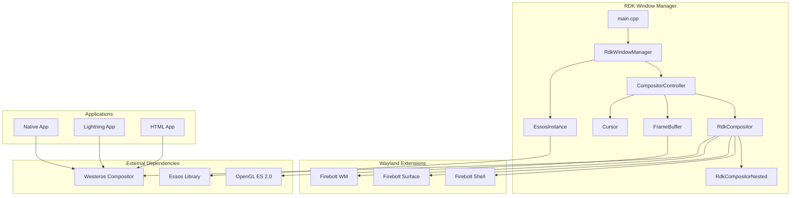

# RDK Window Manager

[](LICENSE)
[](https://rdkcentral.com/)

## Overview

The **RDK Window Manager** is a critical component in the RDK (Reference Design Kit) infrastructure responsible for managing Wayland displays, application window composition, and input/focus handling for embedded Linux devices such as set-top boxes and smart TVs.

Built on top of **Westeros** (Wayland compositor) and **Essos** (EGL/OpenGL ES abstraction), it provides a robust window management system with custom Firebolt Wayland protocol extensions for enhanced application control.

---

## Key Features

| Feature | Description |
|---------|-------------|
| **Multi-Application Composition** | Manages multiple application windows with z-ordering, visibility, and opacity control |
| **Wayland Protocol Support** | Full Wayland display server with custom Firebolt extensions |
| **Input Management** | Key intercepts, listeners, focus management, and input event routing |
| **Graphics Rendering** | OpenGL ES 2.0-based rendering with FBO support for virtual displays |
| **Inactivity Detection** | User inactivity monitoring and reporting |
| **VNC Server** | Optional remote display capability |
| **Memory Monitoring** | RAM usage monitoring with configurable thresholds |

---

## Architecture



---

## Documentation

### Core Documentation

| Document | Description |
|----------|-------------|
| [Architecture Overview](./docs/architecture.md) | High-level system architecture, component interactions, and design patterns |
| [Core Components](./docs/core-components.md) | Detailed documentation of core classes: RdkCompositor, CompositorController, EssosInstance |
| [Wayland Extensions](./docs/extensions.md) | Firebolt Shell, Surface, and Window Manager Wayland protocol extensions |
| [Configuration & Build](./docs/configuration-build.md) | Build system, CMake options, environment variables, and deployment |

### Additional Documentation

| Document | Description |
|----------|-------------|
| [Input & Events](./docs/input-events.md) | Input device handling, key interception, event propagation |
| [Testing Guide](./docs/testing.md) | Test infrastructure, test applications, and quality analysis |
| [API Reference](./docs/api-reference.md) | Complete API documentation for all public interfaces |

---

## Quick Start

### Prerequisites

| Dependency | Description |
|------------|-------------|
| **CMake** | Version 2.8 or higher |
| **C++14 Compiler** | GCC or Clang with C++14 support |
| **Westeros** | Wayland compositor library |
| **Essos** | EGL/OpenGL ES abstraction |
| **OpenGL ES 2.0** | Graphics rendering |
| **Wayland** | Display server protocol libraries |
| **libpng/libjpeg** | Image loading |

### Building

```bash
# Clone the repository
git clone <repository-url>
cd rdk-window-manager

# Create build directory
mkdir build && cd build

# Configure with CMake
cmake .. \
    -DRDK_WINDOW_MANAGER_BUILD_APP=ON \
    -DRDK_WINDOW_MANAGER_BUILD_EXTENSIONS=ON \
    -DRDK_WINDOW_MANAGER_BUILD_TEST_APP=ON

# Build
make -j$(nproc)
```

### Running

```bash
# Set environment variables (optional)
export RDK_WINDOW_MANAGER_LOG_LEVEL=Debug
export RDK_WINDOW_MANAGER_FRAMERATE=60

# Run the window manager
./rdkwindowmanager
```

---

## Project Structure

```
rdk-window-manager/
├── CMakeLists.txt              # Main CMake configuration
├── include/                    # Public headers
│   ├── rdkwindowmanager.h      # Main namespace API
│   ├── compositorcontroller.h  # Compositor management
│   ├── rdkcompositor.h         # Base compositor class
│   ├── rdkcompositornested.h   # Nested compositor implementation
│   ├── essosinstance.h         # Essos singleton
│   ├── application.h           # Application types and states
│   ├── inputevent.h            # Input event structures
│   ├── logger.h                # Logging utilities
│   └── ...
├── src/                        # Implementation files
│   ├── main.cpp                # Entry point
│   ├── rdkwindowmanager.cpp    # Main loop and initialization
│   ├── compositorcontroller.cpp# Compositor management
│   ├── rdkcompositor.cpp       # Base compositor
│   └── ...
├── extensions/                 # Wayland protocol extensions
│   ├── firebolt_shell/         # Focus/blur events
│   ├── firebolt_surface/       # Surface properties
│   └── firebolt_wm/            # Window manager control
├── tests/                      # Test applications
├── docs/                       # Documentation
└── CMake/                      # CMake modules
```

---

## Configuration

### Environment Variables

| Variable | Default | Description |
|----------|---------|-------------|
| `RDK_WINDOW_MANAGER_LOG_LEVEL` | Information | Log level (Debug, Information, Warn, Error, Fatal) |
| `RDK_WINDOW_MANAGER_FRAMERATE` | 40 | Target frame rate (FPS) |
| `RDK_WINDOW_MANAGER_LOW_MEMORY_THRESHOLD` | 200 | Low RAM threshold (MB) |
| `RDK_WINDOW_MANAGER_KEY_INITIAL_DELAY` | 500 | Key repeat initial delay (ms) |
| `RDK_WINDOW_MANAGER_KEY_REPEAT_INTERVAL` | 100 | Key repeat interval (ms) |

### CMake Options

| Option | Default | Description |
|--------|---------|-------------|
| `RDK_WINDOW_MANAGER_BUILD_APP` | ON | Build main executable |
| `RDK_WINDOW_MANAGER_BUILD_EXTENSIONS` | ON | Build Wayland extensions |
| `RDK_WINDOW_MANAGER_BUILD_TEST_APP` | ON | Build test application |
| `RDK_WINDOW_MANAGER_VNC_SERVER` | OFF | Enable VNC server |

See [Configuration & Build](./docs/configuration-build.md) for complete configuration reference.

---

## Wayland Extensions

The RDK Window Manager provides three custom Wayland protocol extensions:

### Firebolt Shell
- Focus/blur event notifications
- Surface type creation (Standard, Video, Popup, Notification)

### Firebolt Surface  
- Fine-grained surface property control
- Bounds, opacity, z-order, visibility, cropping

### Firebolt WM
- Window manager-level control
- Client creation, destruction, property management
- Client connection/disconnection events

See [Wayland Extensions](./docs/extensions.md) for detailed documentation.

---

## Contributing

Please read [CONTRIBUTING.md](CONTRIBUTING.md) for details on our code of conduct and the process for submitting pull requests.

---

## License

Copyright 2024 RDK Management

Licensed under the Apache License, Version 2.0. See [LICENSE](LICENSE) for details.

---

## Related Projects

- [Westeros](https://github.com/rdkcentral/westeros) - Wayland compositor library
- [Essos](https://github.com/pxscene/pxCore) - EGL/OpenGL ES abstraction
- [Thunder/WPEFramework](https://github.com/WebPlatformForEmbedded/Thunder) - Plugin framework
