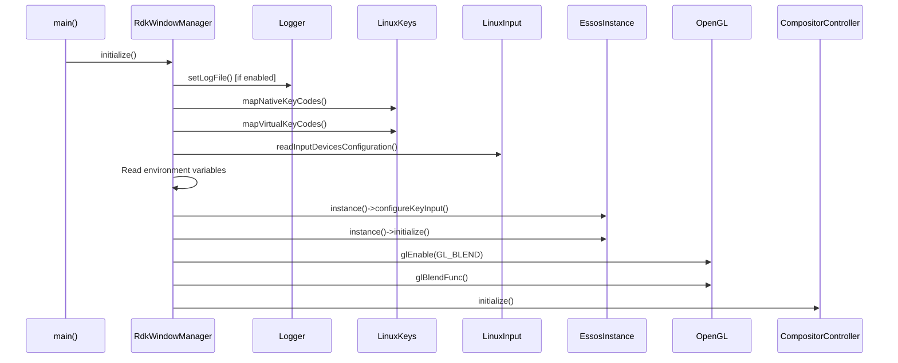
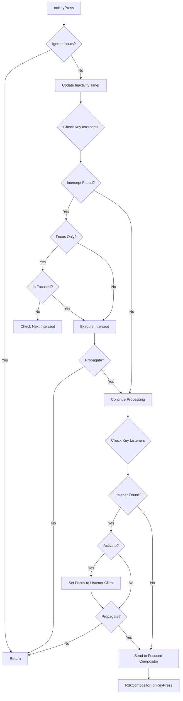
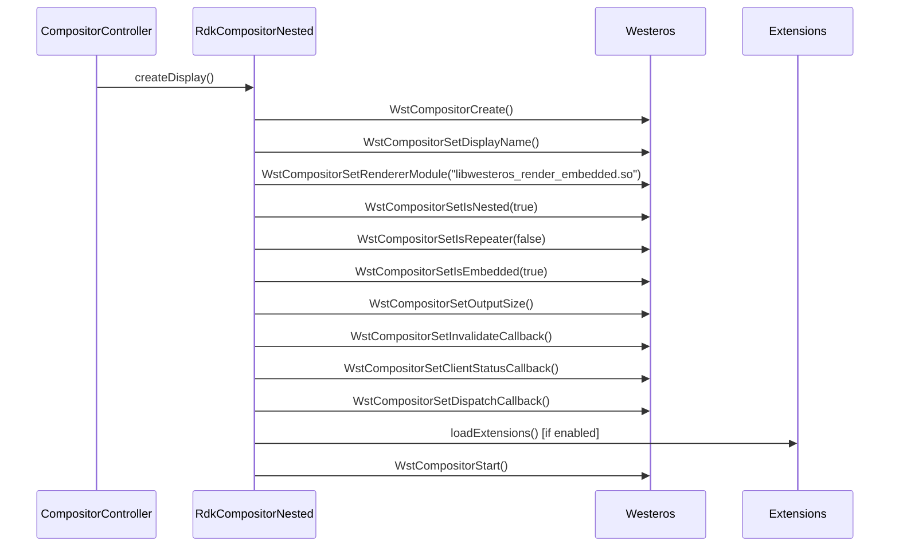
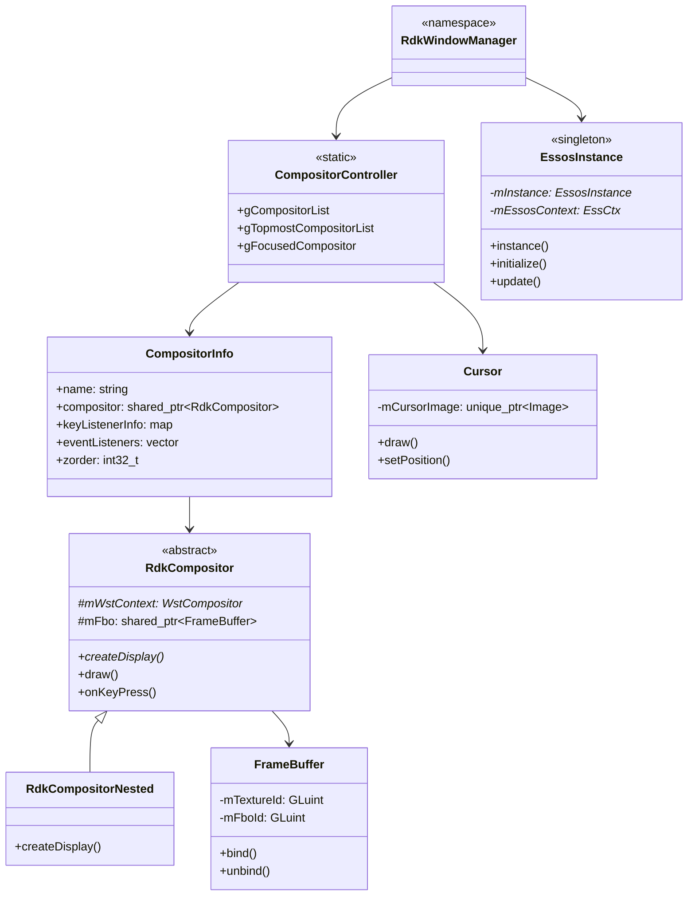

# RDK Window Manager - Core Components

## 1. Overview

This document provides detailed documentation of the core classes that make up the RDK Window Manager:

- **RdkWindowManager** - Main entry point and event loop
- **CompositorController** - Static interface for compositor management
- **RdkCompositor** - Base compositor class
- **RdkCompositorNested** - Nested Wayland compositor implementation
- **EssosInstance** - Essos/EGL abstraction singleton

---

## 2. RdkWindowManager Namespace

**File:** `include/rdkwindowmanager.h`, `src/rdkwindowmanager.cpp`

### Purpose

The `RdkWindowManager` namespace provides the main entry point and run loop for the window manager. It orchestrates initialization, the main rendering loop, and cleanup.

### Public Interface

```cpp
namespace RdkWindowManager
{
    void initialize();      // Initialize all subsystems
    void run();             // Start main event loop
    void update();          // Single update cycle
    void draw();            // Single draw cycle
    void deinitialize();    // Cleanup (currently empty)
    
    // Timing utilities
    double seconds();       // Monotonic time in seconds
    double milliseconds();  // Monotonic time in milliseconds
    double microseconds();  // Monotonic time in microseconds
}
```

### Initialization Flow



### Main Loop

```cpp
// From src/rdkwindowmanager.cpp
void run()
{
    gRdkWindowManagerIsRunning = true;
    while( gRdkWindowManagerIsRunning )
    {
        update();
        
        // Setup viewport
        uint32_t width = 0, height = 0;
        EssosInstance::instance()->resolution(width, height);
        glViewport( 0, 0, width, height );
        glClearColor(0.0f, 0.0f, 0.0f, 0.0f);
        glClear(GL_COLOR_BUFFER_BIT);

        // Render and timing
        const double maxSleepTime = (1000 / gCurrentFramerate) * 1000;
        double startFrameTime = microseconds();
        CompositorController::draw();
        EssosInstance::instance()->update();

        // Frame rate limiting
        double frameTime = microseconds() - startFrameTime;
        if (frameTime < maxSleepTime) {
            usleep((int)maxSleepTime - (int)frameTime);
        }
    }
}
```

### Global Configuration Variables

| Variable | Default | Description |
|----------|---------|-------------|
| `gCurrentFramerate` | 40 FPS | Target frame rate |
| `gEnableRamMonitor` | true | Enable RAM monitoring |
| `gRamMonitorIntervalInSeconds` | 1.0 | RAM check interval |
| `gLowRamMemoryThresholdInMb` | 200 | Low memory warning threshold |
| `gCriticallyLowRamMemoryThresholdInMb` | 100 | Critical memory threshold |
| `gSwapMemoryIncreaseThresoldInMb` | 50 | Swap increase threshold |
| `gForce720` | false | Force 720p resolution |

---

## 3. CompositorController Class

**File:** `include/compositorcontroller.h`, `src/compositorcontroller.cpp`

### Purpose

`CompositorController` is a **static class** that serves as the central management interface for all compositor instances. It handles:

- Compositor creation and destruction
- Z-order management
- Focus control
- Key interception and routing
- Event broadcasting

### Key Data Structures

```cpp
struct CompositorInfo {
    std::string name;                                    // Standardized client name
    std::shared_ptr<RdkCompositor> compositor;           // Compositor instance
    std::map<uint32_t, std::vector<KeyListenerInfo>> keyListenerInfo;
    std::vector<std::shared_ptr<RdkWindowManagerEventListener>> eventListeners;
    std::string mimeType;                                // Application type
    int32_t zorder;                                      // Z-order position
    bool isSuspended;                                    // Suspended state
    uint32_t previousWidth;                              // Size before resize
    uint32_t previousHeight;
};

struct KeyInterceptInfo {
    uint32_t keyCode;
    uint32_t flags;
    bool focusOnly;           // Only intercept when focused
    bool propagate;           // Pass to application after intercept
    CompositorInfo compositorInfo;
};

struct KeyListenerInfo {
    uint32_t keyCode;
    uint32_t flags;
    bool activate;            // Bring to focus on key
    bool propagate;           // Pass key to application
};
```

### Compositor Lists

```cpp
// Global compositor management
CompositorList gCompositorList;           // Regular compositors (z-ordered)
CompositorList gTopmostCompositorList;    // Topmost compositors (always on top)
CompositorInfo gFocusedCompositor;        // Currently focused compositor
CompositorList gDeletedCompositors;       // Pending deletion
```

### Core API Methods

#### Display Creation

```cpp
static bool createDisplay(
    const std::string& client,           // Client name
    const std::string& displayName,      // Wayland display name
    uint32_t displayWidth = 0,           // Display width (0 = screen size)
    uint32_t displayHeight = 0,          // Display height
    bool virtualDisplayEnabled = false,  // Enable FBO rendering
    uint32_t virtualWidth = 0,           // Virtual width
    uint32_t virtualHeight = 0,          // Virtual height
    bool topmost = false,                // Add to topmost list
    bool focus = false,                  // Set focus immediately
    int32_t ownerId = 0,                 // Owner ID
    int32_t groupId = 0                  // Group ID
);
```

#### Z-Order Management

```cpp
static bool moveToFront(const std::string& client);
static bool moveToBack(const std::string& client);
static bool moveBehind(const std::string& client, const std::string& target);
static bool setZorder(const std::string& client, int32_t zorder);
static bool getZOrder(const std::string& client, int32_t &zorder);
static bool setTopmost(const std::string& client, bool topmost, bool focus = false);
static bool getTopmost(std::string& client);
```

#### Focus Management

```cpp
static bool setFocus(const std::string& client);
static bool getFocused(std::string& client);
```

#### Key Management

```cpp
// Key Intercepts - capture keys before reaching application
static bool addKeyIntercept(const std::string& client, const uint32_t& keyCode, 
                           const uint32_t& flags, const bool& focusOnly, 
                           const bool& propagate);
static bool removeKeyIntercept(const std::string& client, const uint32_t& keyCode, 
                              const uint32_t& flags);
static bool removeAllKeyIntercepts();

// Key Listeners - react to specific keys
static bool addKeyListener(const std::string& client, const uint32_t& keyCode, 
                          const uint32_t& flags, 
                          std::map<std::string, RdkWindowManagerData>& listenerProperties);
static bool removeKeyListener(const std::string& client, const uint32_t& keyCode, 
                             const uint32_t& flags);
static bool removeAllKeyListeners();

// Key Generation
static bool injectKey(const uint32_t& keyCode, const uint32_t& flags);
static bool generateKey(const std::string& client, const uint32_t& keyCode, 
                       const uint32_t& flags, std::string virtualKey = "");
```

#### Window Properties

```cpp
static bool getBounds(const std::string& client, uint32_t &x, uint32_t &y, 
                     uint32_t &width, uint32_t &height);
static bool setBounds(const std::string& client, const uint32_t x, const uint32_t y, 
                     const uint32_t width, const uint32_t height);
static bool getVisibility(const std::string& client, bool& visible);
static bool setVisibility(const std::string& client, const bool visible);
static bool getOpacity(const std::string& client, unsigned int& opacity);
static bool setOpacity(const std::string& client, const unsigned int opacity);
static bool getScale(const std::string& client, double &scaleX, double &scaleY);
static bool setScale(const std::string& client, double scaleX, double scaleY);
static bool getHolePunch(const std::string& client, bool& holePunch);
static bool setHolePunch(const std::string& client, const bool holePunch);
static bool getCrop(const std::string& client, int32_t &cropX, int32_t &cropY, 
                   int32_t &cropWidth, int32_t &cropHeight);
static bool setCrop(const std::string& client, int32_t cropX, int32_t cropY, 
                   int32_t cropWidth, int32_t cropHeight);
```

### Key Event Processing Flow



---

## 4. RdkCompositor Class

**File:** `include/rdkcompositor.h`, `src/rdkcompositor.cpp`

### Purpose

`RdkCompositor` is the **base class** for Wayland compositor instances. Each running application has an associated `RdkCompositor` that manages its Wayland display and rendering.

### Class Definition

```cpp
class RdkCompositor
{
public:
    RdkCompositor();
    virtual ~RdkCompositor();
    
    // Pure virtual - must be implemented by derived classes
    virtual bool createDisplay(const std::string& displayName, 
                              const std::string& clientName,
                              uint32_t width, uint32_t height, 
                              bool virtualDisplayEnabled, 
                              uint32_t virtualWidth, uint32_t virtualHeight,
                              int32_t ownerId, int32_t groupId) = 0;

    // Rendering
    void draw(bool &needsHolePunch, RdkWindowManagerRect& rect, bool drawOverlays);
    
    // Input handling
    void onKeyPress(uint32_t keycode, uint32_t flags, uint64_t metadata);
    void onKeyRelease(uint32_t keycode, uint32_t flags, uint64_t metadata);
    void onPointerMotion(uint32_t x, uint32_t y);
    void onPointerButtonPress(uint32_t keyCode, uint32_t x, uint32_t y);
    void onPointerButtonRelease(uint32_t keyCode, uint32_t x, uint32_t y);
    
    // Properties
    void setPosition(int32_t x, int32_t y);
    void position(int32_t &x, int32_t &y);
    void setSize(uint32_t width, uint32_t height);
    void size(uint32_t &width, uint32_t &height);
    void setOpacity(double opacity);
    void opacity(double& opacity);
    void setVisible(bool visible);
    void visible(bool &visible);
    void setScale(double scaleX, double scaleY);
    void scale(double &scaleX, double &scaleY);
    // ... more property methods
    
    // Application lifecycle
    void closeApplication();
    void launchApplication();
    void setApplication(const std::string& application);
    ApplicationState getApplicationState();
    
    // Event listeners
    int registerInputEventListener(std::function<void(const InputEvent&)> listener);
    void unregisterInputEventListener(int tag);
    int registerStateChangeEventListener(std::function<void(uint32_t)> listener);
    void unregisterStateChangeEventListener(int tag);

protected:
    // Westeros callbacks
    static void invalidate(WstCompositor *context, void *userData);
    static void clientStatus(WstCompositor *context, int status, int pid, 
                            int detail, void *userData);
    static void dispatch(WstCompositor *wctx, void *userData);
    
    // Internal methods
    void onInvalidate();
    void onClientStatus(int status, int pid, int detail);
    void processKeyEvent(bool keyPressed, uint32_t keycode, uint32_t flags, 
                        uint64_t metadata);
    void broadcastInputEvent(const InputEvent &inputEvent);
    void broadcastStateChangeEvent(uint32_t state);
    void drawDirect(bool &needsHolePunch, RdkWindowManagerRect& rect, bool drawOverlays);
    void drawFbo(bool &needsHolePunch, RdkWindowManagerRect& rect, bool drawOverlays);
    
    // Member variables
    std::string mDisplayName;
    WstCompositor *mWstContext;
    uint32_t mWidth, mHeight;
    int32_t mPositionX, mPositionY;
    float mMatrix[16];
    double mOpacity;
    bool mVisible;
    bool mAnimating;
    bool mHolePunch;
    double mScaleX, mScaleY;
    int32_t mCropX, mCropY, mCropWidth, mCropHeight;
    int32_t mOwnerId;
    
    // Threading
    std::mutex mInputLock;
    std::unordered_map<int, std::function<void(const InputEvent&)>> mInputListeners;
    std::mutex mStateChangeLock;
    std::unordered_map<int, std::function<void(uint32_t)>> mStateChangeListeners;
    std::recursive_mutex mApplicationMutex;
    
    // Application state
    std::string mApplicationName;
    std::thread mApplicationThread;
    ApplicationState mApplicationState;
    int32_t mApplicationPid;
    bool mApplicationThreadStarted;
    bool mApplicationClosedByCompositor;
    
    // Virtual display (FBO)
    bool mVirtualDisplayEnabled;
    uint32_t mVirtualWidth, mVirtualHeight;
    std::shared_ptr<FrameBuffer> mFbo;
    
    // Firebolt surfaces
    std::vector<FireboltSurfaceInfo> mFireboltSurfaces;
};
```

### FireboltSurfaceInfo Structure

```cpp
struct FireboltSurfaceInfo
{
    WstCompositor* westerosCompositor;  // Associated compositor
    int surfaceId;                       // Unique surface ID
    SurfaceType surfaceType;             // Standard, Video, Popup, Notification
    int32_t x, y;                        // Position
    uint32_t width, height;              // Size
    int32_t sx, sy;                      // Source crop position
    uint32_t swidth, sheight;            // Source crop size
    double opacity;                      // Opacity (0.0 - 1.0)
    bool visible;                        // Visibility
    int zOrder;                          // Z-order
    std::string name;                    // Surface name
};
```

### Client Status Events

```cpp
void RdkCompositor::onClientStatus(int status, int pid, int detail)
{
    switch (status) {
        case WstClient_stoppedNormal:
            eventName = RDK_WINDOW_MANAGER_EVENT_APPLICATION_TERMINATED;
            break;
        case WstClient_stoppedAbnormal:
            eventName = RDK_WINDOW_MANAGER_EVENT_APPLICATION_TERMINATED;
            break;
        case WstClient_connected:
            eventName = RDK_WINDOW_MANAGER_EVENT_APPLICATION_CONNECTED;
            break;
        case WstClient_disconnected:
            eventName = RDK_WINDOW_MANAGER_EVENT_APPLICATION_DISCONNECTED;
            break;
        case WstClient_firstFrame:
            eventName = RDK_WINDOW_MANAGER_EVENT_APPLICATION_FIRST_FRAME;
            break;
    }
    CompositorController::onEvent(this, eventName);
}
```

---

## 5. RdkCompositorNested Class

**File:** `include/rdkcompositornested.h`, `src/rdkcompositornested.cpp`

### Purpose

`RdkCompositorNested` is the concrete implementation of `RdkCompositor` that creates **nested Wayland compositors** using Westeros.

### Implementation

```cpp
class RdkCompositorNested : public RdkCompositor
{
public:
    bool createDisplay(const std::string& displayName, 
                      const std::string& clientName,
                      uint32_t width, uint32_t height, 
                      bool virtualDisplayEnabled, 
                      uint32_t virtualWidth, uint32_t virtualHeight,
                      int32_t ownerId, int32_t groupId) override;
};
```

### Display Creation Process



---

## 6. EssosInstance Class

**File:** `include/essosinstance.h`, `src/essosinstance.cpp`

### Purpose

`EssosInstance` is a **singleton** that provides abstraction over the Essos library for EGL/OpenGL ES context management and input device handling.

### Singleton Pattern

```cpp
class EssosInstance
{
public:
    ~EssosInstance();
    static EssosInstance* instance();  // Get singleton instance
    
    void initialize(bool useWayland);
    void initialize(bool useWayland, uint32_t width, uint32_t height);
    void configureKeyInput(uint32_t initialDelay, uint32_t repeatInterval);
    
    // Input events
    void onKeyPress(uint32_t keyCode, unsigned long flags, uint64_t metadata);
    void onKeyRelease(uint32_t keyCode, unsigned long flags, uint64_t metadata);
    void onPointerMotion(uint32_t x, uint32_t y);
    void onPointerButtonPress(uint32_t keyCode, uint32_t x, uint32_t y);
    void onPointerButtonRelease(uint32_t keyCode, uint32_t x, uint32_t y);
    void onDisplaySizeChanged(uint32_t width, uint32_t height);
    
    // Main update (swaps buffers)
    void update();
    
    // Resolution management
    void resolution(uint32_t &width, uint32_t &height);
    void setResolution(uint32_t width, uint32_t height);
    
    // Key repeats
    void setKeyRepeats(bool enable);
    void keyRepeats(bool& enable);
    void ignoreKeyInputs(bool ignore);
    
    // AV Blocking (ERM)
    bool setAVBlocked(std::string app, bool blockAV);
    void getBlockedAVApplications(std::vector<std::string> &appsList);
    bool isErmEnabled();

private:
    EssosInstance();  // Private constructor
    static EssosInstance* mInstance;
    
    EssCtx* mEssosContext;
    bool mUseWayland;
    uint32_t mWidth, mHeight;
    bool mOverrideResolution;
    uint32_t mKeyInitialDelay;
    uint32_t mKeyRepeatInterval;
    bool mKeyRepeatsEnabled;
    bool mKeyInputsIgnored;
};
```

### Initialization

The `EssosInstance` registers callbacks with the Essos library that forward input events to the `CompositorController`:

```cpp
void EssosInstance::initialize(bool useWayland)
{
    mEssosContext = EssContextCreate();
    
    // Set callbacks for input events
    EssContextSetKeyListener(mEssosContext, this, keyCallback);
    EssContextSetPointerListener(mEssosContext, this, pointerCallback);
    EssContextSetDisplaySizeListener(mEssosContext, this, displaySizeCallback);
    
    // Initialize graphics
    EssContextInit(mEssosContext);
    EssContextStart(mEssosContext);
    
    // Get display size
    EssContextGetDisplaySize(mEssosContext, &mWidth, &mHeight);
}
```

---

## 7. Supporting Classes

### FrameBuffer

**File:** `include/framebuffer.h`, `src/framebuffer.cpp`

```cpp
class FrameBuffer
{
public:
    FrameBuffer(int width, int height);
    ~FrameBuffer();

    int width() const { return mWidth; }
    int height() const { return mHeight; }
    GLuint texture() const { return mTextureId; }

    void bind();    // Bind FBO for rendering
    void unbind();  // Unbind FBO

private:
    int mWidth, mHeight;
    GLuint mTextureId;
    GLuint mFboId;
};
```

### Logger

**File:** `include/logger.h`, `src/logger.cpp`

```cpp
enum LogLevel { Debug, Information, Warn, Error, Fatal };

class Logger
{
public:
    static void log(LogLevel level, const char* format, ...);
    static void setLogLevel(const char* loglevel);
    static void logLevel(std::string& level);
    static void setLogFile(const std::string& filename);  // If RDK_WINDOW_MANAGER_LOGGER
    static void enableFlushing(bool enable);
    static bool isFlushingEnabled();
};
```

### Cursor

**File:** `include/cursor.h`, `src/cursor.cpp`

```cpp
class Cursor
{
public:
    Cursor(const std::string& fileName);

    void draw();
    void setPosition(int32_t x, int32_t y);
    bool load(const std::string& fileName);

    void setInactivityDuration(double inactivityDuration);
    void setSize(uint32_t width, uint32_t height);
    void setOffset(int32_t x, int32_t y);

    void show();
    void hide();

private:
    std::unique_ptr<Image> mCursorImage;
    int32_t mX, mY;
    uint32_t mWidth, mHeight;
    int32_t mOffsetX, mOffsetY;
    double mInactivityDuration;
    double mLastUpdateTime;
    bool mIsVisible, mIsLoaded;
};
```

---

## 8. Class Relationships Diagram


