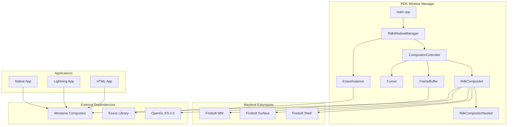

# RDK Window Manager - Complete Documentation

## Overview

The **RDK Window Manager** is a critical component in the RDK (Reference Design Kit) infrastructure responsible for managing Wayland displays, application window composition, and input/focus handling for embedded Linux devices such as set-top boxes and smart TVs.

---

## Documentation Index

| Document | Description |
|----------|-------------|
| [Architecture Overview](./architecture.md) | High-level system architecture, component interactions, and design patterns |
| [Core Components](./RDK_WindowManager.md) | Detailed documentation of core classes: RdkCompositor, CompositorController, EssosInstance |
| [Wayland Extensions](./extensions.md) | Firebolt Shell, Surface, and Window Manager Wayland protocol extensions |
| [Configuration & Build](./configuration-build.md) | Build system, CMake options, environment variables, and deployment |
| [Input & Event Handling](./input-events.md) | Input device handling, key interception, event propagation |
| [API Reference](./api-reference.md) | Complete API documentation for Thunder plugin interfaces |
| [Testing Guide](./testing.md) | Test infrastructure, test applications, and quality analysis |

---

## Quick Start

### Dependencies

- **Westeros** - Wayland compositor library
- **Essos** - EGL/OpenGL ES abstraction layer  
- **OpenGL ES 2.0** - Graphics rendering
- **Wayland** - Display server protocol

### Building

```bash
mkdir build && cd build
cmake .. -DRDK_WINDOW_MANAGER_BUILD_APP=ON
make -j$(nproc)
```

### Running

```bash
./rdkwindowmanager
```

---

## Architecture Summary



---

## Key Features

1. **Multi-Application Composition** - Manages multiple application windows with z-ordering, visibility, and opacity control
2. **Wayland Protocol Support** - Full Wayland display server with custom Firebolt extensions
3. **Input Management** - Key intercepts, listeners, focus management, and input event routing
4. **Graphics Rendering** - OpenGL ES 2.0-based rendering with FBO support for virtual displays
5. **Inactivity Detection** - User inactivity monitoring and reporting
6. **VNC Server** - Optional remote display capability (when enabled)
7. **Memory Monitoring** - RAM usage monitoring with configurable thresholds

---

## License

Copyright 2024 RDK Management - Apache License 2.0

See [LICENSE](../LICENSE) for full details.
