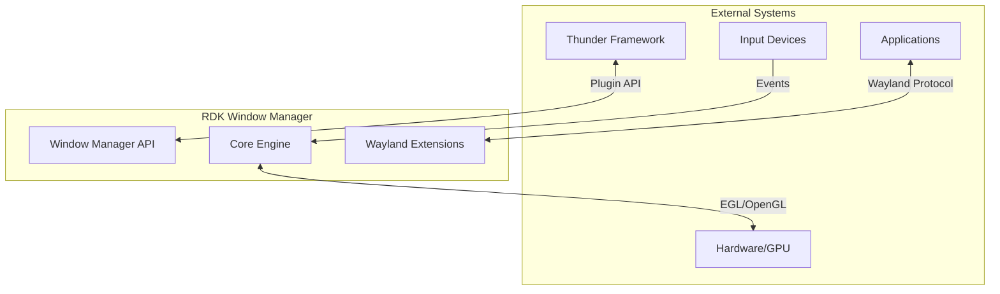
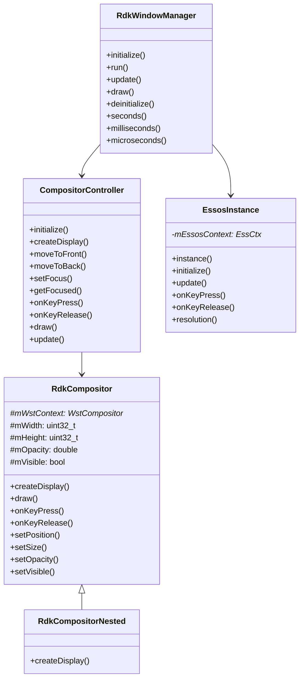
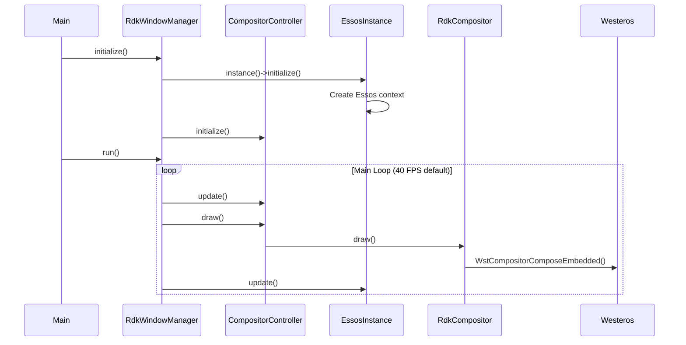
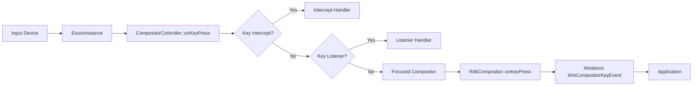
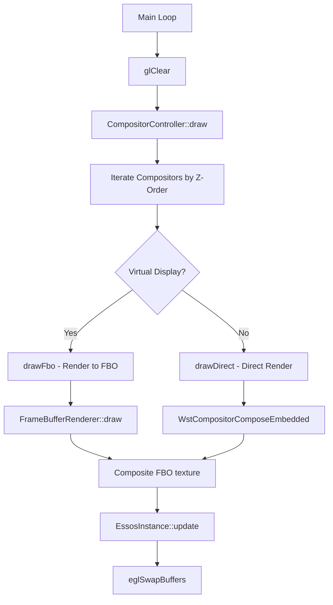
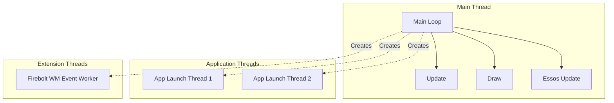
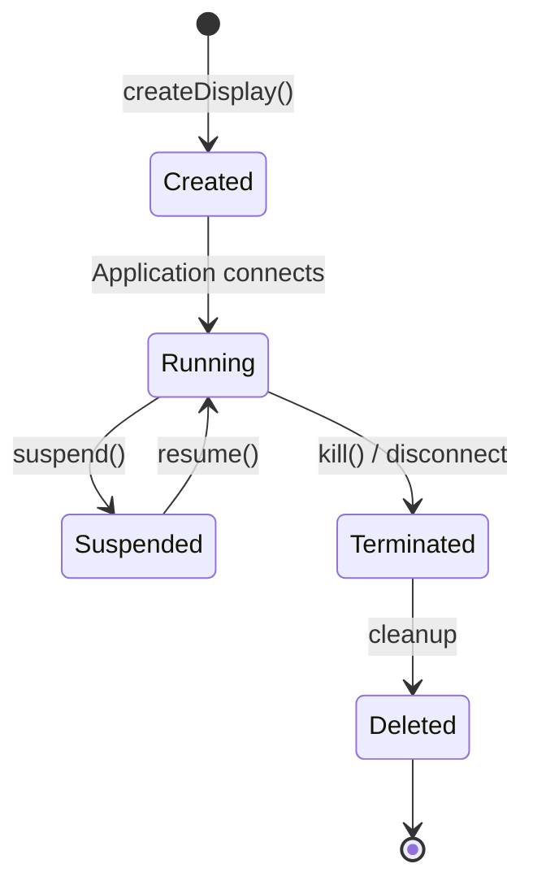

# RDK Window Manager - Architecture Overview

## 1. High-Level Purpose & Architecture

### Role in RDK Infrastructure

The RDK Window Manager serves as the **central window management and composition system** for RDK-based devices. It acts as the bridge between:

- **Applications** (Native, Lightning, HTML) requiring display surfaces
- **Hardware Graphics** (OpenGL ES 2.0, EGL)
- **System Services** (Thunder plugins, input devices)

### Primary Responsibilities

| Responsibility | Description |
|----------------|-------------|
| **Display Management** | Create and manage Wayland displays for applications |
| **Window Composition** | Composite multiple application surfaces with z-ordering, opacity, and transformations |
| **Input Routing** | Route keyboard, pointer, and touch events to focused applications |
| **Focus Management** | Control application focus and visibility states |
| **Resource Management** | Monitor and manage graphics resources and memory |

### What RDK Window Manager Does NOT Do

- **Application Lifecycle Management** - Handled by Thunder/WPEFramework
- **Media Playback** - Handled by dedicated media pipelines
- **Network Operations** - Outside scope of window management
- **Persistent Storage** - No direct storage management

---

## 2. Architectural Overview

### System Context Diagram



### Major Components



### Component Interactions



---

## 3. Layer Architecture

```
┌─────────────────────────────────────────────────────────────────┐
│                        Thunder Plugin API                        │
│              (CreateDisplay, SetFocus, GetApps, etc.)           │
├─────────────────────────────────────────────────────────────────┤
│                     CompositorController                         │
│         (Static interface for compositor management)             │
├─────────────────────────────────────────────────────────────────┤
│                                                                  │
│  ┌──────────────┐  ┌──────────────┐  ┌──────────────────────┐  │
│  │ RdkCompositor│  │ EssosInstance│  │  Wayland Extensions  │  │
│  │   (Nested)   │  │  (Singleton) │  │ (Shell/Surface/WM)   │  │
│  └──────────────┘  └──────────────┘  └──────────────────────┘  │
│                                                                  │
├─────────────────────────────────────────────────────────────────┤
│                     RdkWindowManager Core                        │
│              (Main loop, timing, initialization)                 │
├─────────────────────────────────────────────────────────────────┤
│                                                                  │
│  ┌──────────────┐  ┌──────────────┐  ┌──────────────────────┐  │
│  │   Westeros   │  │    Essos     │  │   OpenGL ES 2.0      │  │
│  │  Compositor  │  │   Library    │  │   (Rendering)        │  │
│  └──────────────┘  └──────────────┘  └──────────────────────┘  │
│                                                                  │
├─────────────────────────────────────────────────────────────────┤
│                     Hardware / Kernel                            │
│              (DRM/KMS, GPU, Input devices)                       │
└─────────────────────────────────────────────────────────────────┘
```

---

## 4. Data Flow

### Input Event Flow



### Rendering Pipeline



---

## 5. Threading Model



### Thread Safety

| Component | Thread Safety Mechanism |
|-----------|------------------------|
| `CompositorController` | Static methods, global mutex for compositor list |
| `RdkCompositor` | `mApplicationMutex` (recursive), `mInputLock`, `mStateChangeLock` |
| `EssosInstance` | Singleton pattern, single-threaded access |
| `FireboltWindowManager` | `mContextLock`, `mQueueMutex` with condition variable |

---

## 6. Memory Management

### Compositor Lifecycle



### Resource Ownership

| Resource | Owner | Cleanup |
|----------|-------|---------|
| `WstCompositor*` | `RdkCompositor` | Destructor calls `WstCompositorDestroy` |
| `FrameBuffer` | `RdkCompositor` (shared_ptr) | Automatic via shared_ptr |
| `CompositorInfo` | `gCompositorList` / `gTopmostCompositorList` | Removed on termination |
| `FireboltSurfaceInfo` | `RdkCompositor::mFireboltSurfaces` | Vector clear on destructor |

---

## 7. Error Handling Strategy

```cpp
// Pattern used throughout the codebase
bool CompositorController::someOperation(const std::string& client) {
    CompositorListIterator it;
    if (!getCompositorInfo(client, it)) {
        Logger::log(LogLevel::Error, "Client not found: %s", client.c_str());
        return false;
    }
    
    // Perform operation
    return true;
}
```

### Error Categories

| Category | Handling |
|----------|----------|
| Client not found | Return `false`, log error |
| Westeros errors | Check return values, log via `WstCompositorGetLastErrorDetail` |
| OpenGL errors | Not explicitly checked (performance consideration) |
| Memory allocation | Standard C++ exception handling |

---

## 8. Configuration Points

See [Configuration & Build](./configuration-build.md) for detailed configuration options.

| Configuration | Type | Description |
|---------------|------|-------------|
| `RDK_WINDOW_MANAGER_FRAMERATE` | Environment | Target FPS (default: 40) |
| `RDK_WINDOW_MANAGER_LOG_LEVEL` | Environment | Logging verbosity |
| `RDK_WINDOW_MANAGER_LOW_MEMORY_THRESHOLD` | Environment | RAM warning threshold (MB) |
| Build options | CMake | Feature toggles (extensions, VNC, etc.) |
