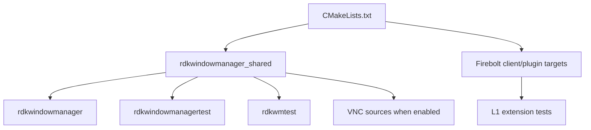
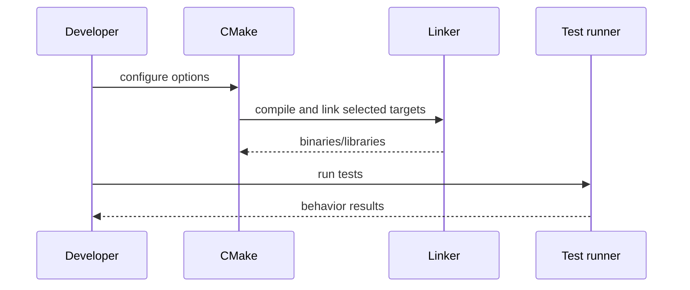
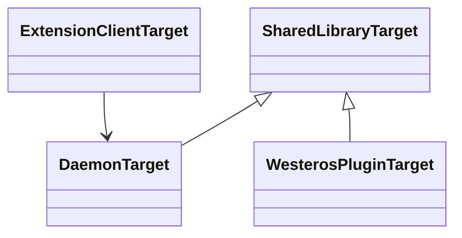
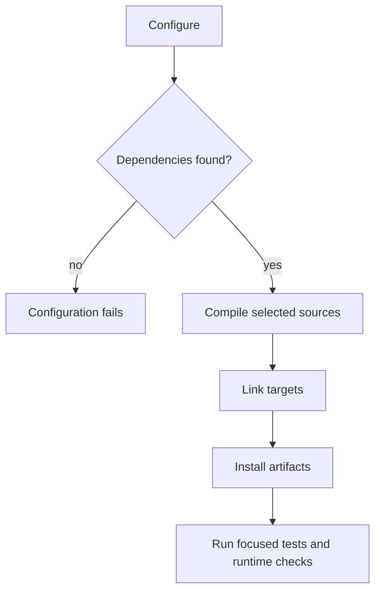

# Build, Integration, and Test Surface

## 1. High-Level Purpose & Architecture

### Role in ENT / RDK infrastructure
This component is the assembly and verification layer for the RDK window manager. CMake selects product features, links platform dependencies, and builds the daemon, shared library, extensions, and test programs.

### Responsibilities
- Configure C++14 compilation and feature definitions.
- Build the shared manager library and optional executable.
- Build Firebolt client libraries and Westeros plugins.
- Build interactive/test executables and L1 suites.
- Install runtime libraries and plugins in product-facing locations.

### Interacting subsystems and what it does not do
Build files connect subsystems but do not define runtime window policy. Tests validate behavior through public APIs, mocks, protocol clients, and integration executables.

## 2. Architectural Overview



## 3. Code Organization (Folder & File-Level)

- `CMakeLists.txt`: top-level options, source lists, definitions, dependencies, targets, and install paths.
- `CMake/FindGLIB.cmake`, `CMake/FindLibSoup.cmake`: optional VNC dependency discovery.
- `extensions/*/CMakeLists.txt`: client and Westeros plugin target definitions.
- `tests/CMakeLists.txt`, `tests/L1_Tests/CMakeLists.txt`, `tests/L1_Tests/l1tests.cmake`: test assembly.
- `tests/testmain.cpp`: interactive test executable entry.
- `tests/testrdkwm.cpp`: curl-based/API harness.
- `tests/L1_Tests/*`: protocol-focused suites, common helpers, and mocks.

## 4. Class & Interface Documentation

This subsystem is target/configuration oriented rather than class oriented. The main runtime classes under test are `CompositorController`, `RdkCompositor`, and the Firebolt plugin objects. Test doubles in `tests/L1_Tests/mocks/` isolate external dependencies.

The principal target relationship is visible in CMake:

```cmake
add_library(rdkwindowmanager_shared SHARED ${RDK_WINDOW_MANAGER_SOURCES})
add_executable(rdkwindowmanager src/main.cpp)
```

Source: [CMakeLists.txt](../../CMakeLists.txt).

Lifecycle is configure -> compile/link -> install -> execute tests. Feature definitions must remain consistent with source inclusion and link libraries.

## 5. Configuration & Build Integration

Notable options include `RDK_WINDOW_MANAGER_BUILD_APP`, `RDK_WINDOW_MANAGER_BUILD_EXTENSIONS`, `RDK_WINDOW_MANAGER_BUILD_TEST_APP`, `RDK_WINDOW_MANAGER_VNC_SERVER`, `ENABLE_RDKWINDOWMANAGER_VNCSERVER2`, `RDK_WINDOW_MANAGER_BUILD_KEY_METADATA`, `RDK_WINDOW_MANAGER_BUILD_FORCE_1080`, `RDK_WINDOW_MANAGER_BUILD_KEYBUBBING_TOP_MODE`, `RDK_WINDOW_MANAGER_BUILD_ENABLE_KEYREPEATS`, and `BUILD_ENABLE_ERM`.

The core links Essos, EGL/GLESv2, Wayland, Westeros, pthread, JPEG, and PNG. VNC additionally requires GLib/GIO/GObject, LibSoup, Boost, and secure_wrapper. Extension plugins install beneath `lib/plugins/westeros/`.

## 6. Internal Workflows & Execution Flow

1. CMake evaluates options and external dependency availability.
2. It adds compile definitions and source files for enabled features.
3. Targets link the shared manager, platform libraries, and optional protocol/VNC dependencies.
4. Tests build against shared code, protocol libraries, mocks, or curl.
5. Deployment installs libraries/plugins; runtime loads configured Westeros extensions.

A build can succeed while a runtime plugin is unavailable if the plugin directory or additional-extension configuration is wrong. Deployment validation must therefore include installed artifacts and loader configuration.

## 7. Diagrams & Visual Aids







## 8. Testing & Quality Analysis

The repository contains test applications, `rdkwmtest`, common L1 helpers, mocks, and separate Firebolt WM, Shell, and Surface suites. Existing coverage should be supplemented with negative-path assertions, event-order checks, feature-off compile jobs, VNC-enabled builds, plugin-load smoke tests, and cleanup/thread shutdown tests. Test execution commands are documented in `tests/README.md` and `docs/testing.md`.

## 9. Beginner-to-Expert Teaching Mode

### Must know first
Learn the difference between the shared runtime library, daemon executable, client extension library, and Westeros server plugin. Then configure a minimal build with tests enabled.

### Advanced learning path
Compare feature definitions with source inclusion, inspect generated protocol artifacts, run coverage/L1 builds, and test the matrix of optional VNC, ERM, rendering, and input flags.

### Missing or ambiguous
The repository does not provide a single authoritative build matrix for all product platforms, and some external dependency versions and deployment-time plugin loading rules are environment-specific.
