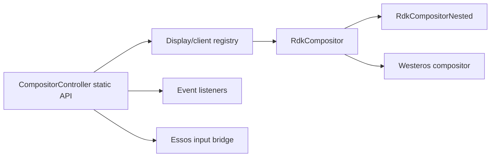
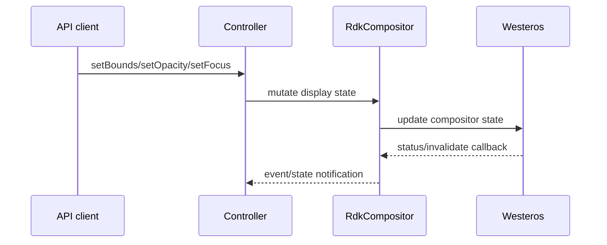
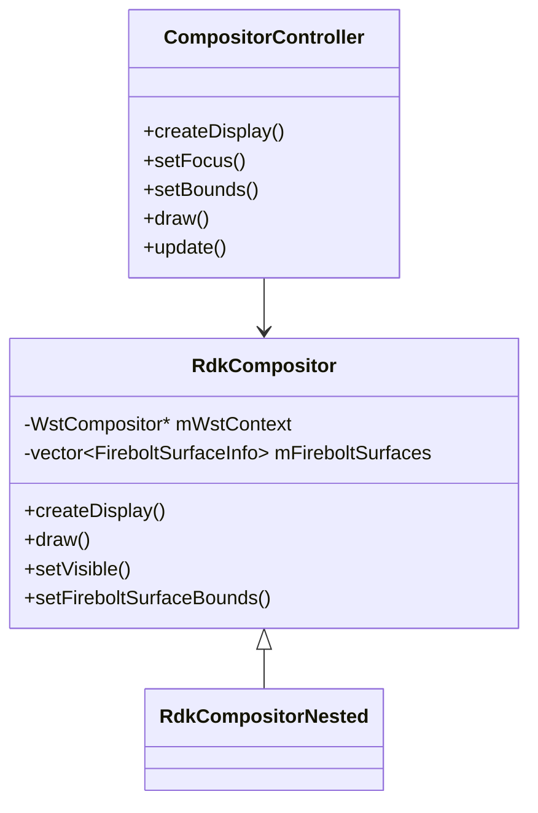
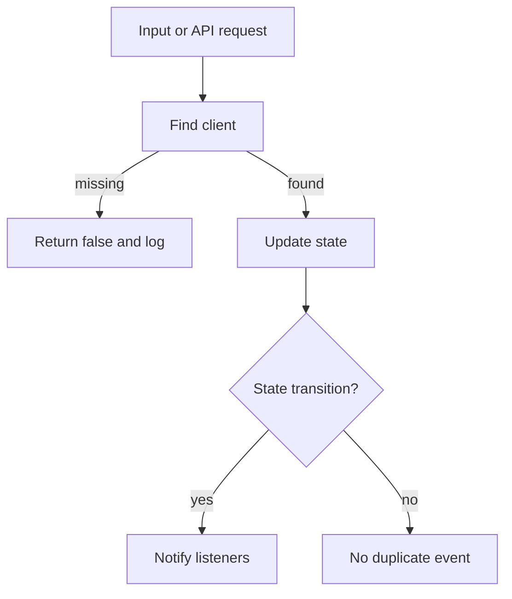

# Compositor and Window Control

## 1. High-Level Purpose & Architecture

### Role in ENT / RDK infrastructure
This subsystem turns public window-management operations into per-display composition state backed by Westeros. It is the control plane for applications, focus, z-order, visibility, geometry, and Firebolt surfaces.

### Responsibilities
- Maintain display/client lookup and `ClientInfo` state.
- Create and coordinate `RdkCompositor` instances.
- Route key and pointer input, including intercepts, listeners, injection, and repeats.
- Emit lifecycle, focus, visibility, and extension events.
- Manage crop, scale, opacity, hole-punch, virtual display, and screenshot operations.

### Interacting subsystems and what it does not do
`CompositorController` delegates display mechanics to `RdkCompositor` and input acquisition to `EssosInstance`. Direct Westeros calls belong in `src/rdkcompositor*.cpp`; the controller does not own the wire protocol implementation.

## 2. Architectural Overview



## 3. Code Organization (Folder & File-Level)

- `include/compositorcontroller.h`, `src/compositorcontroller.cpp`: static public control surface, registries, event routing, and orchestration.
- `include/rdkcompositor.h`, `src/rdkcompositor.cpp`: common compositor state, callbacks, rendering, application lifecycle, and Firebolt surface collection.
- `include/rdkcompositornested.h`, `src/rdkcompositornested.cpp`: nested Westeros implementation.
- `include/rdkwindowmanagerevents.h`: listener contracts.
- `include/rdkwindowmanagerrect.h`: rectangle value type used by hole-punch APIs.

`ClientInfo` contains bounds, scale, opacity, z-order, visibility, crop, and owner ID. `FireboltSurfaceInfo` contains analogous surface-level state plus type and name.

## 4. Class & Interface Documentation

`CompositorController` is a static facade. Major method groups are display creation, focus/z-order, geometry, input registration, event registration, rendering, Firebolt surface operations, and optional VNC/splash controls.

`RdkCompositor` owns one display context. Its lifecycle includes construction, `createDisplay`, callback-driven updates, drawing, and destruction. Its members include a Westeros handle, natural and logical dimensions, transform state, listener maps protected by mutexes, application state, and a vector of Firebolt surfaces.

Representative declaration:

```cpp
static bool setBounds(const std::string& client, const uint32_t x,
    const uint32_t y, const uint32_t width, const uint32_t height);
static bool setFocus(const std::string& client);
static bool draw();
```

Source: [include/compositorcontroller.h](../../include/compositorcontroller.h).

The base class requires derived classes to implement `createDisplay`; its event callbacks are static adapters that forward into instance methods.

## 5. Configuration & Build Integration

The shared library always includes both compositor source files and links `-lwesteros_compositor`, `-lwayland-client`, and `-lessos`. Build definitions gate key metadata, hidden support, forced resolution, animation, external surface composition, key bubbling, key repeats, transparent background, and ERM.

The default Westeros plugin directory is `/usr/lib/plugins/westeros/`, unless `RDK_WINDOW_MANAGER_WESTEROS_PLUGIN_FOLDER` is supplied. Additional extension loading can be configured with `RDK_WINDOW_MANAGER_ADDITIONAL_EXTENSIONS_CONFIG`.

## 6. Internal Workflows & Execution Flow

1. `createDisplay` constructs and initializes a compositor for a client/display.
2. Status and invalidate callbacks update application/display state.
3. Controller methods locate the client and mutate compositor state.
4. Input callbacks are converted to events and routed according to focus, intercept, listener, and propagation rules.
5. `draw` orders displays/surfaces, applies transforms and crop, and handles hole-punch/render paths.
6. Shutdown closes applications and destroys compositor handles.

The code tracks natural render size separately from logical reported size. The semantic contract for display bounds versus render bounds is not fully documented outside comments in `rdkcompositor.h`.

## 7. Diagrams & Visual Aids







## 8. Testing & Quality Analysis

Public controller behavior is covered primarily through `tests/testrdkwm.cpp` and mocks/L1 tests. The extension suites exercise related surface and client behavior. Recommended gaps are negative tests for missing clients, duplicate visibility/focus events, z-order ties, listener removal during callbacks, and concurrent listener-map access.

## 9. Beginner-to-Expert Teaching Mode

### Must know first
Learn the distinction between a client/display, a compositor instance, and a Firebolt surface. Start with `ClientInfo`, `RdkCompositor`, then the controller facade.

### Advanced learning path
Trace key bubbling and propagation through `onKeyPress`, then study direct versus FBO rendering and hole-punch rectangle preparation. Verify lock scope before changing callback or listener behavior.

### Missing or ambiguous
The meaning of the overlay z-order threshold used by hole-punch rendering and the exact event ordering across all Westeros statuses are implementation details not defined by the public interface.
