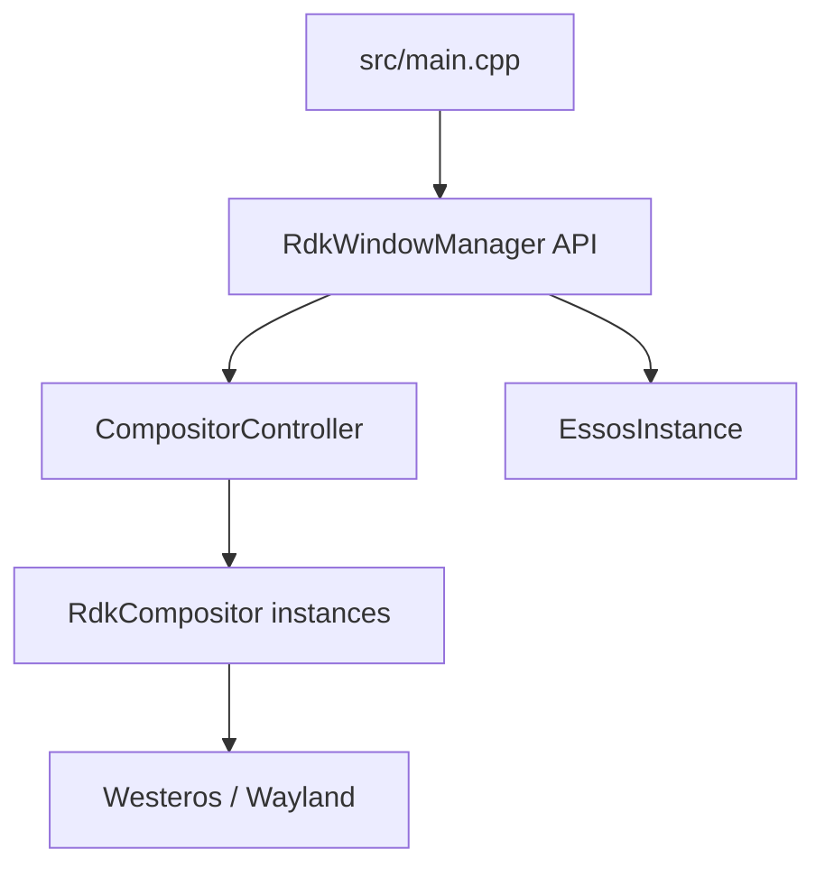
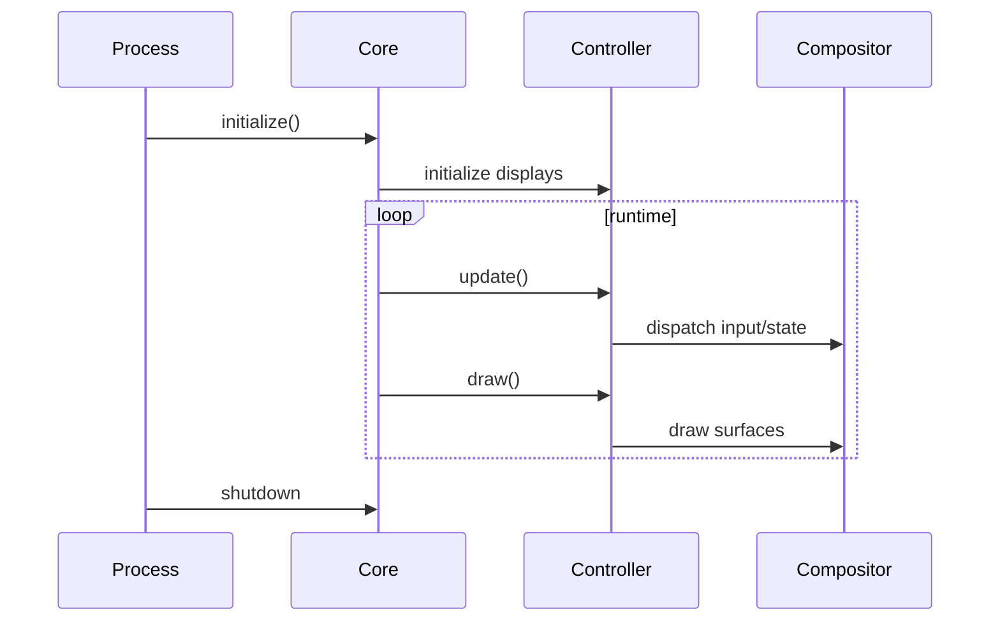
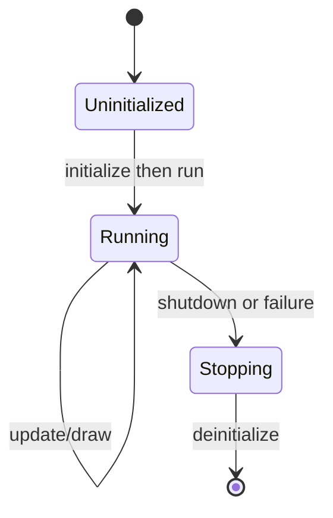

# Core Window Manager

## 1. High-Level Purpose & Architecture

### Role in ENT / RDK infrastructure
The core is the process-facing API for the RDK window manager. It starts the daemon, drives update and draw cycles, and exposes the shared coordination point used by compositor control, input, rendering, and Firebolt integrations.

### Responsibilities
- Provide `initialize`, `run`, `update`, `draw`, and `deinitialize` entry points.
- Coordinate display creation and per-frame work through `CompositorController`.
- Apply runtime settings such as frame rate, logging, key repeat, splash, and memory-related configuration.
- Translate controller events into registered listener callbacks.

### Interacting subsystems and what it does not do
It delegates actual surface composition to `RdkCompositor` and input acquisition to `EssosInstance`. It does not implement the Westeros protocol, OpenGL shader operations, or the Firebolt wire protocol itself.

## 2. Architectural Overview

`src/main.cpp` calls the namespace API. The core initializes shared services, then the controller owns the display/compositor collection.



## 3. Code Organization (Folder & File-Level)

- `include/rdkwindowmanager.h`: process lifecycle and time functions.
- `src/rdkwindowmanager.cpp`: initialization, main loop, configuration, update/draw coordination.
- `src/main.cpp`: executable entry point and top-level exception boundary.
- `include/rdkwindowmanagerevents.h`: listener interfaces consumed by the controller.
- `include/application.h`: application states and MIME-related types.
- `CMakeLists.txt`: builds `rdkwindowmanager_shared` and, when enabled, the daemon executable.

Key dependency direction is core -> controller -> compositor; the core should not bypass that boundary for Westeros calls.

## 4. Class & Interface Documentation

The core has a namespace API rather than a public manager class:

- `RdkWindowManager::initialize()`: prepares shared services.
- `RdkWindowManager::run()`: owns the runtime loop.
- `RdkWindowManager::update()` and `draw()`: advance state and render a frame.
- `RdkWindowManager::deinitialize()`: releases runtime state.
- `seconds`, `milliseconds`, and `microseconds`: time helpers.

The executable entry is an intentionally small adapter:

```cpp
RdkWindowManager::initialize();
RdkWindowManager::run();
```

Source: [src/main.cpp](../../src/main.cpp).

Lifecycle is initialize -> run/update/draw -> deinitialize. The exact loop pacing and shutdown conditions are implemented in `src/rdkwindowmanager.cpp`; callers should not assume that `run()` returns only on normal shutdown.

## 5. Configuration & Build Integration

The root CMake file sets C++14 and includes core sources in `RDK_WINDOW_MANAGER_SOURCES`. Important options include `RDK_WINDOW_MANAGER_BUILD_APP`, `RDK_WINDOW_MANAGER_BUILD_TEST_APP`, `RDK_WINDOW_MANAGER_BUILD_FORCE_1080`, `RDK_WINDOW_MANAGER_BUILD_KEYBUBBING_TOP_MODE`, and `RDK_WINDOW_MANAGER_BUILD_ENABLE_KEYREPEATS`. The default daemon links the shared library and pthread.

Environment names used by the core include `RDK_WINDOW_MANAGER_FRAMERATE`, `RDK_WINDOW_MANAGER_LOG_LEVEL`, `RDK_WINDOW_MANAGER_KEY_INITIAL_DELAY`, and `RDK_WINDOW_MANAGER_KEY_REPEAT_INTERVAL`. Defaults and validation are in `src/rdkwindowmanager.cpp`; the repository does not provide a single formal environment reference.

## 6. Internal Workflows & Execution Flow

1. `main` invokes initialization.
2. Initialization configures logging, input, controller state, and displays according to available configuration.
3. `run` repeatedly calls update and draw while the process remains active.
4. Update dispatches input and compositor state; draw composites visible displays and overlays.
5. Shutdown tears down displays and support services.

Errors are generally reported through `Logger`; exact behavior for every failed external initialization path should be confirmed in the implementation.

## 7. Diagrams & Visual Aids





## 8. Testing & Quality Analysis

The executable and API are exercised indirectly by `tests/testrdkwm.cpp`, `tests/testmain.cpp`, and L1 extension tests under `tests/L1_Tests/`. Suggested additions are focused tests for invalid environment values, initialization failure cleanup, frame-rate pacing, and idempotent shutdown. No dedicated core lifecycle test file is evident in the discovered tree.

## 9. Beginner-to-Expert Teaching Mode

### Must know first
Understand that the core is orchestration, not the compositor. Start with `main.cpp`, then follow `initialize`, `run`, `update`, and `draw` into `CompositorController`.

### Advanced learning path
Trace how controller listeners map compositor status to public events, then inspect configuration parsing and shutdown ordering in `src/rdkwindowmanager.cpp`. Pay particular attention to external-handle error paths and state transitions.

### Missing or ambiguous
The exact memory-monitoring actions and the splash completion signaling mechanism are not fully inferable from the public headers alone. Consult the implementation and target platform integration before documenting them as contractual behavior.
