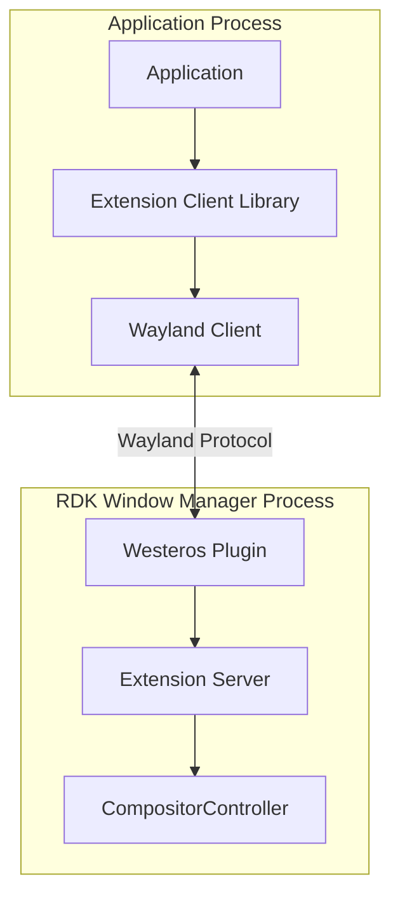
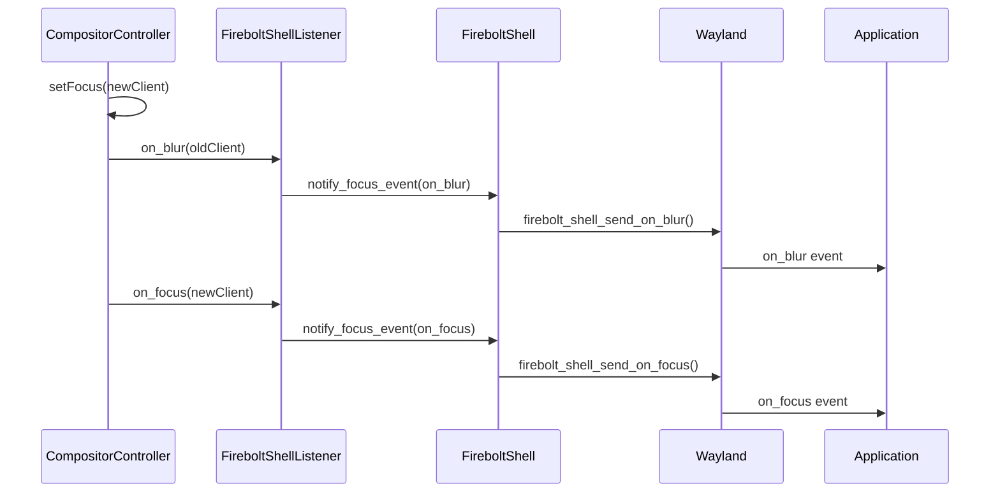
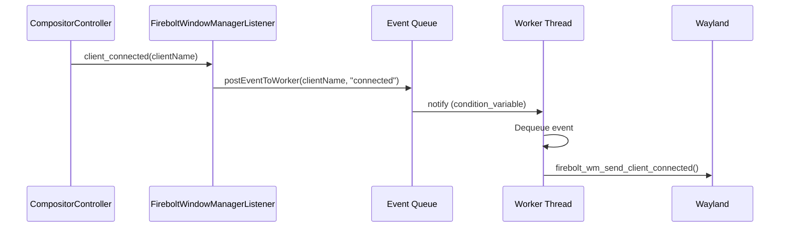
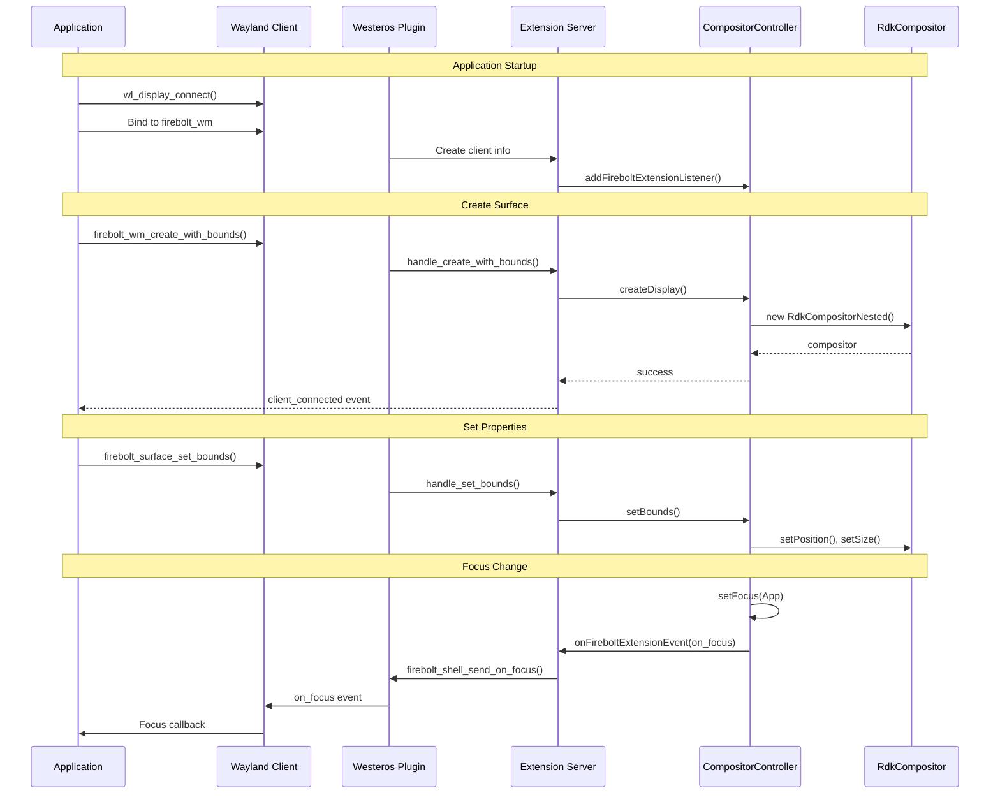

# RDK Window Manager - Wayland Extensions

## 1. Overview

The RDK Window Manager provides three Wayland protocol extensions that enable enhanced communication between applications and the compositor:

| Extension | Purpose | Library |
|-----------|---------|---------|
| **Firebolt Shell** | Focus/blur events, surface creation | `rdkwmextfireboltshell` |
| **Firebolt Surface** | Surface properties (bounds, visibility, z-order) | `rdkwmextfireboltsurface` |
| **Firebolt WM** | Window manager control (create, destroy, properties) | `rdkwmextfireboltwm` |

These extensions are loaded as Westeros plugins and provide both server-side (compositor) and client-side (application) interfaces.

---

## 2. Extension Architecture



### File Organization

```
extensions/
├── firebolt_shell/
│   ├── CMakeLists.txt
│   ├── include/
│   │   ├── firebolt_shell.h                    # Server implementation header
│   │   ├── firebolt_shell_protocol_client.h    # Client protocol header
│   │   └── firebolt_shell_protocol_server.h    # Server protocol header
│   ├── protocol/
│   │   └── firebolt_shell.xml                  # Wayland protocol definition
│   └── src/
│       ├── firebolt_shell.cpp                  # Server implementation
│       └── firebolt_shell_protocol.c           # Generated protocol code
├── firebolt_surface/
│   └── [similar structure]
└── firebolt_wm/
    └── [similar structure]
```

---

## 3. Firebolt Shell Extension

**Purpose:** Provides focus/blur event notifications and Firebolt surface creation.

### Server Class

**File:** `extensions/firebolt_shell/include/firebolt_shell.h`

```cpp
typedef struct {
    uint32_t            clientId;
    std::string         clientName;
    struct wl_display*  display;
    wl_resource*        resource;
} FireboltShellClientInfo;

class FireboltShell {
public:
    FireboltShell();
    ~FireboltShell();
    
    FireboltShellClientInfo* getFireboltShellClientInfo(wl_resource *resource);

    typedef std::map<wl_resource*, FireboltShellClientInfo*> ClientListMap;
    ClientListMap           mClientListMap;
    FireboltShell*          mInstance;
    static std::mutex       mContextLock;
    wl_global*              mWlGlobal;
    WstCompositor*          mWstCompositor;
    struct wl_display*      mWlDisplay;
    std::string             mWstDisplayName;

    // Event listener for focus/blur notifications
    static std::shared_ptr<RdkWindowManager::FireboltExtensionEventListener> 
        mFireboltShellEventListener;
    
    class FireboltShellListener : public RdkWindowManager::FireboltExtensionEventListener {
    public:
        void on_focus(const char* clientName) override;
        void on_blur(const char* clientName) override;
        
        void notify_focus_event(const char* clientName,
                               const std::string& eventName,
                               void (*fbShellEventCallback)(wl_resource*, const char*));
    };
};
```

### Protocol Interface

#### Requests (Client → Server)

| Request | Description |
|---------|-------------|
| `get_firebolt_surface` | Create a Firebolt shell surface from a Wayland surface |

#### Events (Server → Client)

| Event | Description |
|-------|-------------|
| `firebolt_video_surface_id` | Sent in reply to `get_firebolt_surface` for video surfaces |
| `on_focus` | Sent when the application gains focus |
| `on_blur` | Sent when the application loses focus |

### Focus Event Flow



---

## 4. Firebolt Surface Extension

**Purpose:** Provides fine-grained control over individual surface properties.

### Server Class

**File:** `extensions/firebolt_surface/include/firebolt_surface.h`

```cpp
typedef struct {
    uint32_t            clientId;
    std::string         clientName;
    struct wl_display*  display;
    wl_resource*        resource;
} FireboltSurfaceClientInfo;

class FireboltSurface {
public:
    FireboltSurface();
    ~FireboltSurface();
    
    FireboltSurfaceClientInfo* getFireboltSurfaceClientInfo(wl_resource *resource);
    std::string getFireboltSurfaceClientName(wl_resource *resource);

    typedef std::map<wl_resource*, FireboltSurfaceClientInfo*> ClientListMap;
    ClientListMap           mClientListMap;
    FireboltSurface*        mInstance;
    static std::mutex       mContextLock;
    wl_global*              mWlGlobal;
    WstCompositor*          mWstCompositor;
    struct wl_display*      mWlDisplay;
    std::string             mWstDisplayName;
};
```

### Protocol Interface

#### Requests (Client → Server)

| Request | Parameters | Description |
|---------|------------|-------------|
| `destroy` | - | Destroy the Firebolt surface |
| `set_name` | `name: string` | Set the surface name |
| `set_visible` | `visible: int` | Set surface visibility |
| `set_bounds` | `x, y, width, height` | Set surface position and size |
| `set_crop` | `sx, sy, swidth, sheight` | Set source cropping rectangle |
| `set_zorder` | `zorder: int` | Set z-order relative to other surfaces |
| `set_opacity` | `opacity: fixed` | Set surface opacity (0.0 - 1.0) |

### Surface Types

```cpp
// From include/rdkwindowmanagertypes.h
enum SurfaceType {
    Standard = 1,      // Normal application surface
    Video = 2,         // Video playback surface (hole punch)
    Popup = 3,         // Popup/dialog surface
    Notification = 4   // Notification overlay surface
};
```

### Usage Example (Client Side)

```c
// Application code using firebolt_surface
struct firebolt_surface* fb_surface;

// Set surface bounds
firebolt_surface_set_bounds(fb_surface, 100, 100, 800, 600);

// Set opacity
firebolt_surface_set_opacity(fb_surface, wl_fixed_from_double(0.8));

// Set z-order (higher = on top)
firebolt_surface_set_zorder(fb_surface, 10);

// Make visible
firebolt_surface_set_visible(fb_surface, 1);
```

---

## 5. Firebolt WM Extension

**Purpose:** Provides window manager-level control for creating, destroying, and managing application windows.

### Server Class

**File:** `extensions/firebolt_wm/include/firebolt_wm.h`

```cpp
typedef struct {
    uint32_t            clientId;
    std::string         clientName;
    struct wl_display*  display;
    wl_resource*        resource;
} FireboltWmClientInfo;

struct FireboltWmEventMessage {
    std::string clientName;
    std::string eventName;
};

class FireboltWindowManager {
public:
    FireboltWindowManager();
    ~FireboltWindowManager();
    
    FireboltWmClientInfo* getFireboltWmClientInfo(wl_resource *resource);

    typedef std::map<wl_resource*, FireboltWmClientInfo*> ClientListMap;
    ClientListMap                 mClientListMap;
    FireboltWindowManager*        mInstance;
    static std::mutex             mContextLock;
    wl_global*                    mWlGlobal;
    WstCompositor*                mWstCompositor;
    struct wl_display*            mWlDisplay;
    std::string                   mWstDisplayName;

    // Event worker thread
    std::queue<FireboltWmEventMessage> mEventQueue;
    std::mutex mQueueMutex;
    std::condition_variable mQueueCV;
    std::thread mWorkerThread;
    std::atomic<bool> mThreadRunning{false};

    void fireboltWMEventWorkerThread();
    void createFireboltWMEventWorker();
    void deleteFireboltWMEventWorker();

    bool notify_client_event(const char* clientName,
                            const std::string& eventName,
                            void (*fbWindowManagerEventCallback)(wl_resource*, const char*));

    // Event listener
    static std::shared_ptr<RdkWindowManager::FireboltExtensionEventListener> 
        mFireboltWindowManagerEventListener;
    
    class FireboltWindowManagerListener : public RdkWindowManager::FireboltExtensionEventListener {
    public:
        void client_connected(const char* clientName) override;
        void client_disconnected(const char* clientName) override;
        void postEventToWorker(const char* clientName, const std::string& eventName);
    };
};
```

### Protocol Interface

**File:** `extensions/firebolt_wm/include/firebolt_wm_protocol_client.h`

#### Requests (Client → Server)

| Request | Description |
|---------|-------------|
| `set_properties` | Update surface properties (position, size, opacity, z-order, visibility, crop) |
| `create` | Create a new client/window |
| `create_with_bounds` | Create with initial bounds |
| `create_with_properties` | Create with full property set |
| `destroy` | Destroy a client/window |
| `set_client_bounds` | Set client bounds |
| `set_client_display_bounds` | Set display bounds |
| `get_client_properties` | Request client properties |
| `get_focused_client` | Request focused client ID |
| `get_clients` | Request list of all clients |
| `set_focused_client` | Set focused client |
| `get_owner` | Get client owner ID |
| `set_owner` | Set client owner ID |

#### Events (Server → Client)

| Event | Description |
|-------|-------------|
| `client_properties` | Response with client properties |
| `focused_client` | Response with focused client ID |
| `clients` | Response with client list |
| `client_owner` | Response with client owner |
| `client_connected` | Notification when client connects |
| `client_disconnected` | Notification when client disconnects |

### Client Properties Structure

```cpp
struct firebolt_wm_listener {
    void (*client_properties)(void *data,
                              struct firebolt_wm *firebolt_wm,
                              const char *id,
                              int32_t x,
                              int32_t y,
                              uint32_t width,
                              uint32_t height,
                              wl_fixed_t opacity,
                              int32_t zorder,
                              int32_t visible,
                              wl_fixed_t crop_x,
                              wl_fixed_t crop_y,
                              wl_fixed_t crop_width,
                              wl_fixed_t crop_height,
                              int32_t textured);
    
    void (*focused_client)(void *data,
                          struct firebolt_wm *firebolt_wm,
                          const char *id);
    
    void (*clients)(void *data,
                   struct firebolt_wm *firebolt_wm,
                   const char *id);
    
    void (*client_owner)(void *data,
                        struct firebolt_wm *firebolt_wm,
                        const char *id,
                        int32_t owner);
    
    void (*client_connected)(void *data,
                            struct firebolt_wm *firebolt_wm,
                            const char *id);
    
    void (*client_disconnected)(void *data,
                               struct firebolt_wm *firebolt_wm,
                               const char *id);
};
```

### Event Worker Thread

The Firebolt WM extension uses a dedicated worker thread to handle events asynchronously:



---

## 6. Build Configuration

### CMake Options

```cmake
option(RDK_WINDOW_MANAGER_BUILD_EXTENSIONS "Build Wayland extensions" ON)
option(RDK_WINDOW_MANAGER_BUILD_FIREBOLT_SURFACE_EXTENSION "Build Firebolt Surface" ON)
option(RDK_WINDOW_MANAGER_BUILD_FIREBOLT_SHELL_EXTENSION "Build Firebolt Shell" ON)
option(RDK_WINDOW_MANAGER_BUILD_FIREBOLT_WM_EXTENSION "Build Firebolt WM" ON)
```

### Extension CMakeLists.txt Example

**File:** `extensions/firebolt_wm/CMakeLists.txt`

```cmake
# Client library (for applications)
add_library(rdkwmextfireboltwm_shared SHARED
    src/firebolt_wm_protocol.c
)
target_link_libraries(rdkwmextfireboltwm_shared -lwayland-client)
set_target_properties(rdkwmextfireboltwm_shared PROPERTIES 
    OUTPUT_NAME "rdkwmextfireboltwm"
)
install(TARGETS rdkwmextfireboltwm_shared DESTINATION lib/)

# Westeros plugin (for compositor)
add_library(wstplugin_rdkwmfireboltwm_shared SHARED
    src/firebolt_wm.cpp
    src/firebolt_wm_protocol.c
)
target_link_libraries(wstplugin_rdkwmfireboltwm_shared 
    -lwayland-server 
    rdkwindowmanager_shared
)
set_target_properties(wstplugin_rdkwmfireboltwm_shared PROPERTIES 
    OUTPUT_NAME "wstplugin_rdkwmfireboltwm"
)
install(TARGETS wstplugin_rdkwmfireboltwm_shared 
    DESTINATION lib/plugins/westeros/
)
```

### Plugin Loading

Extensions are loaded by the `RdkCompositor` when creating a display:

```cpp
// From src/rdkcompositor.cpp
bool RdkCompositor::loadExtensions(WstCompositor *compositor, 
                                   const std::string& clientName)
{
    // Load extensions from configured plugin directory
    // Default: /usr/lib/plugins/westeros/
    
    #ifdef RDK_WINDOW_MANAGER_BUILD_FIREBOLT_SURFACE_EXTENSION
    WstCompositorLoadPlugin(compositor, "wstplugin_rdkwmfireboltsurface.so");
    #endif
    
    #ifdef RDK_WINDOW_MANAGER_BUILD_FIREBOLT_SHELL_EXTENSION
    WstCompositorLoadPlugin(compositor, "wstplugin_rdkwmfireboltshell.so");
    #endif
    
    #ifdef RDK_WINDOW_MANAGER_BUILD_FIREBOLT_WM_EXTENSION
    WstCompositorLoadPlugin(compositor, "wstplugin_rdkwmfireboltwm.so");
    #endif
    
    return true;
}
```

---

## 7. Extension Event Listener Interface

**File:** `include/rdkwindowmanagerevents.h`

```cpp
class FireboltExtensionEventListener {
public:
    virtual void on_focus(const char* clientName) {}
    virtual void on_blur(const char* clientName) {}
    virtual void client_connected(const char* clientName) {}
    virtual void client_disconnected(const char* clientName) {}
};

// Event name constants
const std::string RDK_WINDOW_MANAGER_FIREBOLT_EXTENTION_EVENT_ON_FOCUS = "on_focus";
const std::string RDK_WINDOW_MANAGER_FIREBOLT_EXTENTION_EVENT_ON_BLUR = "on_blur";
const std::string RDK_WINDOW_MANAGER_FIREBOLT_EXTENSION_EVENT_CLIENT_CONNECTED = "client_connected";
const std::string RDK_WINDOW_MANAGER_FIREBOLT_EXTENSION_EVENT_CLIENT_DISCONNECTED = "client_disconnected";
```

### Registering Extension Listeners

```cpp
// In CompositorController
static bool addFireboltExtensionListener(
    const std::string& client, 
    std::shared_ptr<FireboltExtensionEventListener> listener
);

static bool removeFireboltExtensionListener(
    const std::string& client, 
    std::shared_ptr<FireboltExtensionEventListener> listener
);

static bool onFireboltExtensionEvent(
    RdkCompositor* eventCompositor, 
    const std::string& eventName
);
```

---

## 8. Integration with CompositorController

### Firebolt Surface Methods in CompositorController

```cpp
// Surface conversion and management
static bool getFireboltSurface(const std::string& client, int surfaceId, uint32_t type);
static bool setFireboltSurfaceZorder(const std::string& client, int surfaceId, int zOrder);
static bool setFireboltSurfaceName(const std::string& client, int surfaceId, 
                                   const std::string& surfaceName);
static bool setFireboltSurfaceOpacity(const std::string& client, int surfaceId, double opacity);
static bool setFireboltSurfaceBounds(const std::string& client, int surfaceId, 
                                     int32_t x, int32_t y, uint32_t width, uint32_t height);
static bool setFireboltSurfaceCrop(const std::string& client, int surfaceId, 
                                   int32_t sx, int32_t sy, uint32_t swidth, uint32_t sheight);
static bool setFireboltSurfaceVisibility(const std::string& client, int surfaceId, bool visible);
static bool fireboltSurfaceDestroy(const std::string& client, int surfaceId);
static bool getSurfaceInfo(const std::string& client, int surfaceId, FireboltSurfaceInfo& si);
```

---

## 9. Sequence Diagram: Complete Extension Flow


