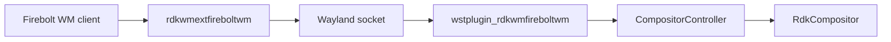
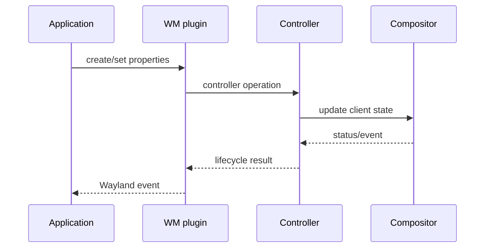
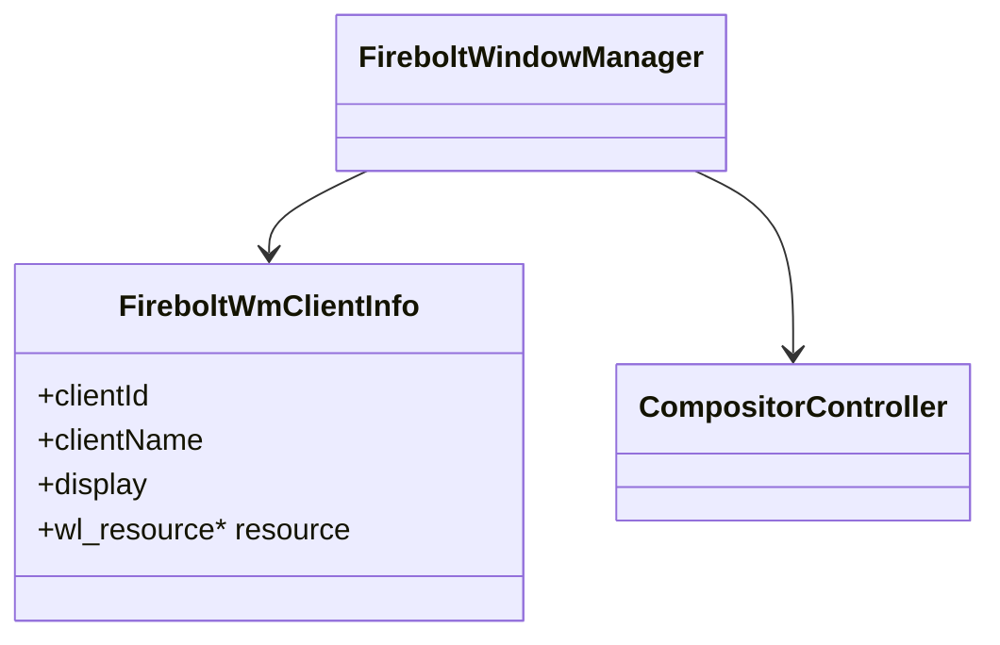
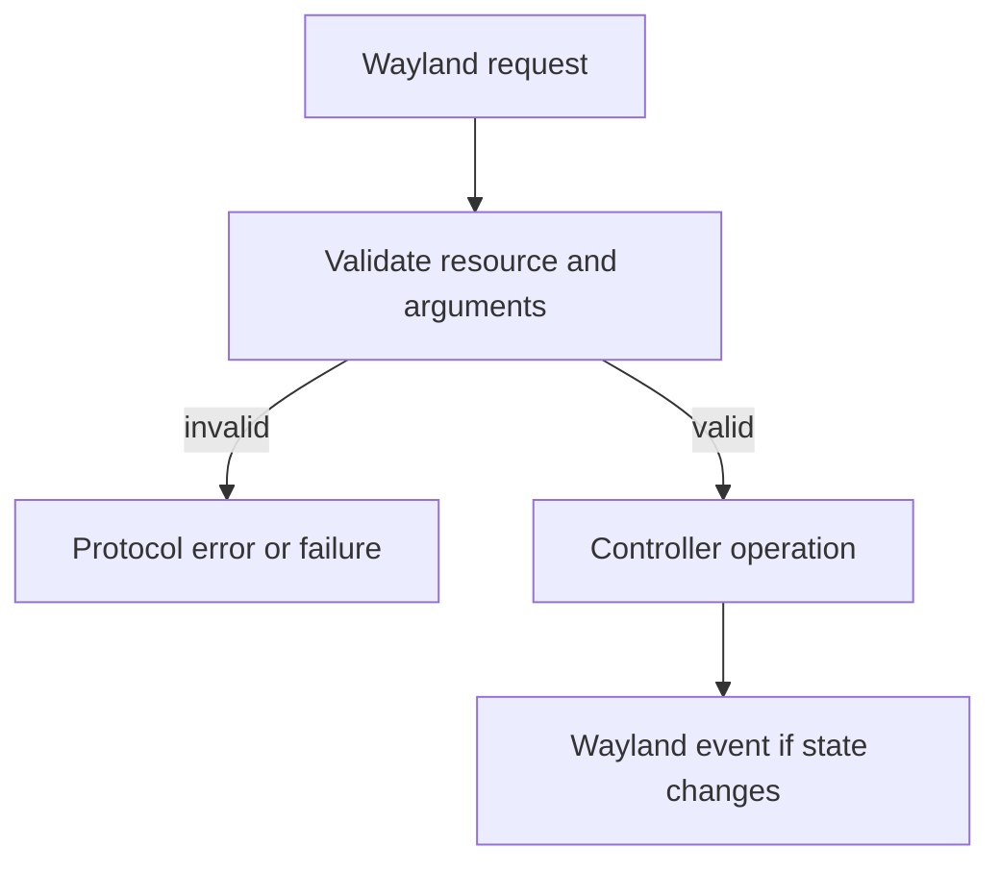

# Firebolt Window Manager Extension

## 1. High-Level Purpose & Architecture

### Role in ENT / RDK infrastructure
Firebolt WM is the client-facing Wayland protocol for creating and controlling application-level window-manager objects. It gives Firebolt-aware applications a protocol path into RDK window policy.

### Responsibilities
- Expose client creation and destruction requests.
- Set client bounds, display bounds, opacity, z-order, visibility, and focus.
- Emit client-connected and client-disconnected events.
- Maintain per-compositor client/resource information.

### Interacting subsystems and what it does not do
The server plugin forwards operations to `CompositorController`; the generated protocol C handles Wayland marshalling. It does not perform composition itself and does not replace the controller's focus/z-order policy.

## 2. Architectural Overview



## 3. Code Organization (Folder & File-Level)

- `protocol/firebolt_wm.xml`: protocol definition.
- `src/firebolt_wm_protocol.c`: generated client/server protocol bindings.
- `src/firebolt_wm.cpp`: Westeros/Wayland server plugin implementation.
- `include/`: exported client-facing declarations and implementation headers.
- `CMakeLists.txt`: builds the client shared library and server plugin.

The protocol-specific C file is generated-style code; semantic behavior is in `firebolt_wm.cpp` and the controller it calls.

## 4. Class & Interface Documentation

`FireboltWindowManager` owns protocol-global/resource behavior. Its operations include `firebolt_wm_create`, `destroy`, property setters, creation with bounds/properties, and client display-bound updates. `FireboltWmClientInfo` associates client ID/name/display with a `wl_resource`.

The implementation uses a static context lock and per-compositor registry according to the discovered source inventory. Server requests should be treated as untrusted input and validated before reaching controller state.

Representative protocol-facing names include:

```text
firebolt_wm_create_with_properties
firebolt_wm_set_client_bounds
firebolt_wm_set_opacity
firebolt_wm_set_focus
```

Source: [extensions/firebolt_wm/src/firebolt_wm.cpp](../../extensions/firebolt_wm/src/firebolt_wm.cpp).

## 5. Configuration & Build Integration

The root option `RDK_WINDOW_MANAGER_BUILD_FIREBOLT_WM_EXTENSION` is enabled under `RDK_WINDOW_MANAGER_BUILD_EXTENSIONS`. CMake builds `rdkwmextfireboltwm_shared` from the client protocol and `wstplugin_rdkwmfireboltwm_shared` from the server implementation plus protocol bindings.

The client library links `wayland-client`; the plugin links `wayland-server` and `rdkwindowmanager_shared`. Installation destinations are `lib/` and `lib/plugins/westeros/`.

## 6. Internal Workflows & Execution Flow

1. An application binds the Firebolt WM global through the client library.
2. A request creates or updates a WM resource.
3. The server validates the resource/client association and calls controller APIs.
4. Controller state changes reach the compositor and may emit lifecycle/focus events.
5. Resource destruction removes registrations and emits disconnect behavior where applicable.

The precise plugin registration entry point and load timing are not fully visible from the header inventory; inspect the implementation and Westeros plugin loader configuration for deployment details.

## 7. Diagrams & Visual Aids







## 8. Testing & Quality Analysis

`tests/L1_Tests/firebolt_wm_tests/` and its mocks are the primary focused coverage. Add negative tests for invalid resources, duplicate creates, invalid bounds/opacity/z-order, disconnect ordering, and event emission only on state transitions.

## 9. Beginner-to-Expert Teaching Mode

### Must know first
Understand Wayland globals, resources, requests, and events. Then map each protocol request to one controller operation.

### Advanced learning path
Trace resource lifetime across compositor registries, thread locking, client-name canonicalization, and event ordering. Review generated protocol code only after understanding the handwritten plugin.

### Missing or ambiguous
The source does not, by itself, document the external product contract for display bounds versus client bounds or the exact plugin discovery sequence.
