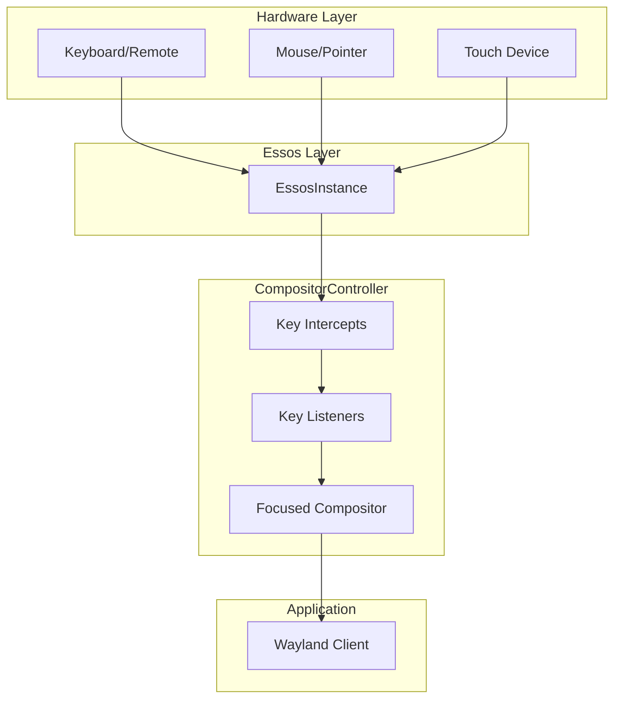
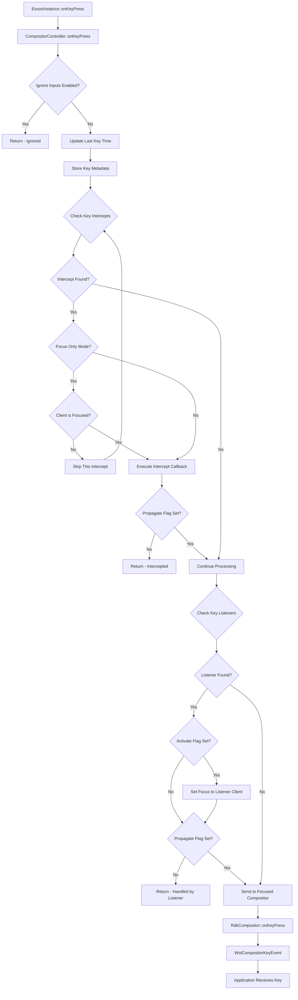
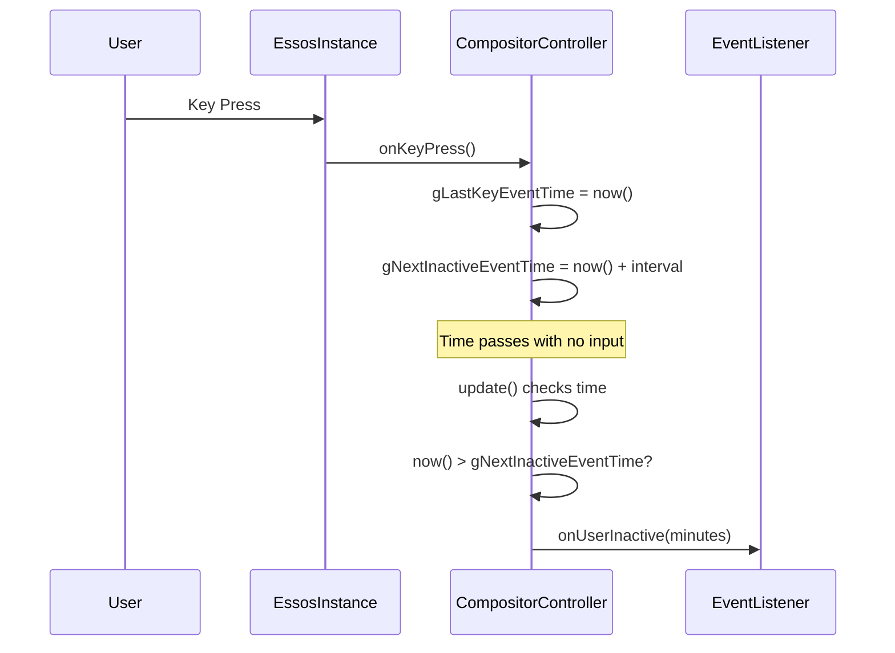
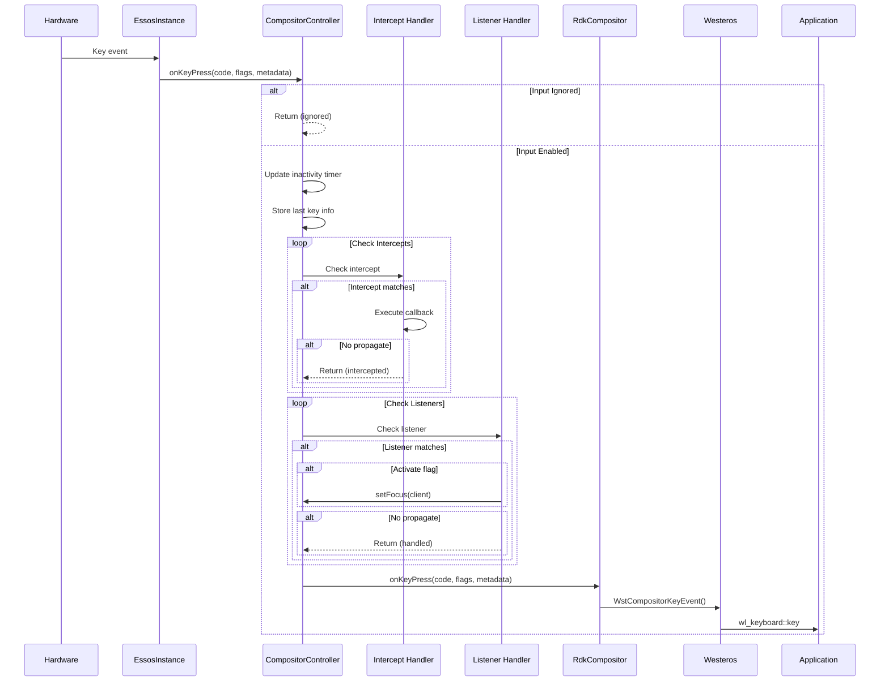

# RDK Window Manager - Input & Event Handling

## 1. Overview

This document covers the input device handling, key interception, event propagation, and event listener system in the RDK Window Manager.

---

## 2. Input Event Architecture



---

## 3. Input Event Types

### InputEvent Structure

**File:** `include/inputevent.h`

```cpp
struct InputEvent
{
    uint32_t deviceId;      // Input device identifier
    uint32_t timestampMs;   // Event timestamp in milliseconds
    
    enum Type { 
        InvalidEvent, 
        KeyEvent, 
        TouchPadEvent, 
        SliderEvent 
    } type;

    union Details
    {
        struct Key {
            int code;
            enum State { 
                Pressed, 
                Released, 
                VirtualPress, 
                VirtualRelease 
            } state;
        } key;

        struct TouchPad {
            int x, y;
            enum State { Down, Up, Click } state;
        } touchpad;

        struct Slider {
            int x;
            enum State { Down, Up } state;
        } slider;
    } details;
};
```

---

## 4. Key Event Processing

### Key Press Flow



### Key Event Data Storage

```cpp
// Global key state tracking (from compositorcontroller.cpp)
uint32_t gLastKeyCode = 0;
uint32_t gLastKeyModifiers = 0;
uint64_t gLastKeyMetadata = 0;
double gLastKeyEventTime = RdkWindowManager::seconds();
double gLastKeyPressStartTime = 0.0;
double gLastKeyRepeatTime = 0.0;
```

---

## 5. Key Intercepts

Key intercepts allow capturing specific keys before they reach the focused application.

### KeyInterceptInfo Structure

```cpp
struct KeyInterceptInfo {
    uint32_t keyCode;       // Key code to intercept
    uint32_t flags;         // Modifier flags
    bool focusOnly;         // Only intercept when client is focused
    bool propagate;         // Pass key to application after intercept
    CompositorInfo compositorInfo;  // Associated compositor
};
```

### API Methods

```cpp
// Add a key intercept
static bool addKeyIntercept(
    const std::string& client,      // Client name
    const uint32_t& keyCode,        // Key code (65536 = any key)
    const uint32_t& flags,          // Modifier flags
    const bool& focusOnly,          // Only when focused
    const bool& propagate           // Pass to app after intercept
);

// Remove a key intercept
static bool removeKeyIntercept(
    const std::string& client,
    const uint32_t& keyCode,
    const uint32_t& flags
);

// Remove all key intercepts
static bool removeAllKeyIntercepts();
```

### Special Key Codes

| Constant | Value | Description |
|----------|-------|-------------|
| `RDK_WINDOW_MANAGER_ANY_KEY` | 65536 | Match any key |
| `RDK_WINDOW_MANAGER_WILDCARD_KEY_CODE` | 255 | Wildcard key code |

### Example: Intercepting Power Key

```cpp
// Intercept power key for all applications
CompositorController::addKeyIntercept(
    "system",           // System handler
    116,                // Power key code
    0,                  // No modifiers
    false,              // Intercept regardless of focus
    false               // Don't propagate to app
);
```

---

## 6. Key Listeners

Key listeners allow applications to react to specific keys and optionally gain focus.

### KeyListenerInfo Structure

```cpp
struct KeyListenerInfo {
    uint32_t keyCode;   // Key code to listen for
    uint32_t flags;     // Modifier flags
    bool activate;      // Bring client to focus on key press
    bool propagate;     // Pass key to application
};
```

### API Methods

```cpp
// Add a key listener
static bool addKeyListener(
    const std::string& client,
    const uint32_t& keyCode,
    const uint32_t& flags,
    std::map<std::string, RdkWindowManagerData>& listenerProperties
);

// Listener properties map keys:
// - "activate": bool - bring to focus on key
// - "propagate": bool - pass key to app

// Add native key listener (same as addKeyListener but for native codes)
static bool addNativeKeyListener(
    const std::string& client,
    const uint32_t& keyCode,
    const uint32_t& flags,
    std::map<std::string, RdkWindowManagerData>& listenerProperties
);

// Remove listeners
static bool removeKeyListener(const std::string& client, 
                              const uint32_t& keyCode, 
                              const uint32_t& flags);
static bool removeNativeKeyListener(const std::string& client, 
                                    const uint32_t& keyCode, 
                                    const uint32_t& flags);
static bool removeAllKeyListeners();
```

### Example: Voice Button Listener

```cpp
// Listen for voice button to activate voice assistant
std::map<std::string, RdkWindowManagerData> props;
props["activate"] = true;   // Bring voice app to focus
props["propagate"] = true;  // Also send key to app

CompositorController::addKeyListener(
    "voice_assistant",
    167,                    // Voice key code
    0,                      // No modifiers
    props
);
```

---

## 7. Key Generation

Generate synthetic key events programmatically.

### API Methods

```cpp
// Inject key to current focused compositor
static bool injectKey(const uint32_t& keyCode, const uint32_t& flags);

// Generate key for specific client
static bool generateKey(
    const std::string& client,
    const uint32_t& keyCode,
    const uint32_t& flags,
    std::string virtualKey = ""     // Optional virtual key name
);

// Generate key with duration (for long press)
static bool generateKey(
    const std::string& client,
    const uint32_t& keyCode,
    const uint32_t& flags,
    std::string virtualKey,
    double duration                 // Hold duration in seconds
);
```

### Long Press Key Generation

```cpp
// Generated key events are queued and processed over time
struct GenerateKeyEvent {
    std::string client;
    double triggerTime;     // When to send key release
    uint32_t keyCode;
    uint32_t modifiers;
};

std::vector<GenerateKeyEvent> gGenerateKeyEvents;
```

---

## 8. Key Repeat Configuration

### Configuration Structure

```cpp
struct KeyRepeatConfig {
    bool enabled;           // Key repeat enabled
    int initialDelay;       // Delay before first repeat (ms)
    int repeatInterval;     // Interval between repeats (ms)
};
```

### API Methods

```cpp
// Configure key repeats
static void setKeyRepeatConfig(bool enabled, int32_t initialDelay, 
                               int32_t repeatInterval);

// Enable/disable key repeats
static bool enableKeyRepeats(bool enable);
static bool getKeyRepeatsEnabled(bool& enable);

// Get last key press info
static bool getLastKeyPress(uint32_t &keyCode, uint32_t &modifiers, 
                           uint64_t &timestampInSeconds);
```

### Environment Variables

| Variable | Default | Description |
|----------|---------|-------------|
| `RDK_WINDOW_MANAGER_KEY_INITIAL_DELAY` | 500 | Initial delay (ms) |
| `RDK_WINDOW_MANAGER_KEY_REPEAT_INTERVAL` | 100 | Repeat interval (ms) |

---

## 9. Pointer/Mouse Events

### Pointer Event Methods

```cpp
// In EssosInstance - receives from hardware
void onPointerMotion(uint32_t x, uint32_t y);
void onPointerButtonPress(uint32_t keyCode, uint32_t x, uint32_t y);
void onPointerButtonRelease(uint32_t keyCode, uint32_t x, uint32_t y);

// In CompositorController - routes to compositor
static void onPointerMotion(uint32_t x, uint32_t y);
static void onPointerButtonPress(uint32_t keyCode, uint32_t x, uint32_t y);
static void onPointerButtonRelease(uint32_t keyCode, uint32_t x, uint32_t y);

// In RdkCompositor - sends to Westeros
void onPointerMotion(uint32_t x, uint32_t y);
void onPointerButtonPress(uint32_t keyCode, uint32_t x, uint32_t y);
void onPointerButtonRelease(uint32_t keyCode, uint32_t x, uint32_t y);
```

### Cursor Management

```cpp
// Show/hide cursor
static bool showCursor();
static bool hideCursor();

// Set cursor size
static bool setCursorSize(uint32_t width, uint32_t height);
static bool getCursorSize(uint32_t& width, uint32_t& height);
```

---

## 10. Event Listeners

### RdkWindowManagerEventListener

**File:** `include/rdkwindowmanagerevents.h`

```cpp
class RdkWindowManagerEventListener {
public:
    // Application lifecycle events
    virtual void onApplicationConnected(const std::string& client) {}
    virtual void onApplicationDisconnected(const std::string& client) {}
    virtual void onApplicationTerminated(const std::string& client) {}
    virtual void onReady(const std::string& client) {}
    
    // User activity events
    virtual void onUserInactive(const double minutes) {}
    
    // Input events
    virtual void onKeyEvent(const uint32_t keyCode, const uint32_t flags, 
                           const bool keyDown) {}
    
    // Window events
    virtual void onSizeChangeComplete(const std::string& client) {}
    virtual void onApplicationVisible(const std::string& client) {}
    virtual void onApplicationHidden(const std::string& client) {}
    virtual void onApplicationFocus(const std::string& client) {}
    virtual void onApplicationBlur(const std::string& client) {}
};
```

### Event Constants

```cpp
const std::string RDK_WINDOW_MANAGER_EVENT_APPLICATION_CONNECTED = "onApplicationConnected";
const std::string RDK_WINDOW_MANAGER_EVENT_APPLICATION_DISCONNECTED = "onApplicationDisconnected";
const std::string RDK_WINDOW_MANAGER_EVENT_APPLICATION_TERMINATED = "onApplicationTerminated";
const std::string RDK_WINDOW_MANAGER_EVENT_APPLICATION_FIRST_FRAME = "onApplicationFirstFrame";
const std::string RDK_WINDOW_MANAGER_EVENT_USER_INACTIVE = "onUserInactive";
const std::string RDK_WINDOW_MANAGER_EVENT_KEY = "onKeyEvent";
const std::string RDK_WINDOW_MANAGER_EVENT_SIZE_CHANGE_COMPLETE = "onSizeChangeComplete";
const std::string RDK_WINDOW_MANAGER_EVENT_APPLICATION_VISIBLE = "onApplicationVisible";
const std::string RDK_WINDOW_MANAGER_EVENT_APPLICATION_HIDDEN = "onApplicationHidden";
const std::string RDK_WINDOW_MANAGER_EVENT_APPLICATION_FOCUS = "onApplicationFocus";
const std::string RDK_WINDOW_MANAGER_EVENT_APPLICATION_BLUR = "onApplicationBlur";
```

### Registering Event Listeners

```cpp
// Per-client event listener
static bool addListener(const std::string& client, 
                       std::shared_ptr<RdkWindowManagerEventListener> listener);
static bool removeListener(const std::string& client, 
                          std::shared_ptr<RdkWindowManagerEventListener> listener);

// Global event listener
static void setEventListener(std::shared_ptr<RdkWindowManagerEventListener> listener);
```

---

## 11. Inactivity Detection

### Configuration

```cpp
// Enable/disable inactivity reporting
static void enableInactivityReporting(const bool enable);

// Set inactivity interval (minutes)
static void setInactivityInterval(const double minutes);

// Reset inactivity timer
static void resetInactivityTime();

// Get current inactivity time
static double getInactivityTimeInMinutes();
```

### Default Values

```cpp
#define RDK_WINDOW_MANAGER_DEFAULT_INACTIVITY_TIMEOUT_IN_SECONDS 15*60  // 15 minutes
```

### Inactivity Flow



---

## 12. Input Event Listener (Per-Compositor)

```cpp
// In RdkCompositor
int registerInputEventListener(
    std::function<void(const RdkWindowManager::InputEvent&)> listener
);
void unregisterInputEventListener(int tag);

// Usage
auto compositor = CompositorController::getCompositor("myapp");
int tag = compositor->registerInputEventListener([](const InputEvent& event) {
    if (event.type == InputEvent::KeyEvent) {
        // Handle key event
    }
});

// Later, to unregister
compositor->unregisterInputEventListener(tag);
```

---

## 13. Input Enable/Disable

```cpp
// Ignore all key inputs globally
static bool ignoreKeyInputs(bool ignore);

// Enable/disable input events per compositor
static bool enableInputEvents(const std::string& client, bool enable);

// In RdkCompositor
void enableInputEvents(bool enable);
bool getInputEventsEnabled() const;
```

---

## 14. Sequence Diagram: Complete Input Flow


