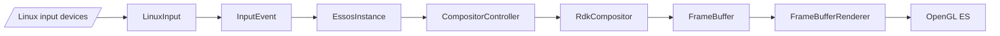
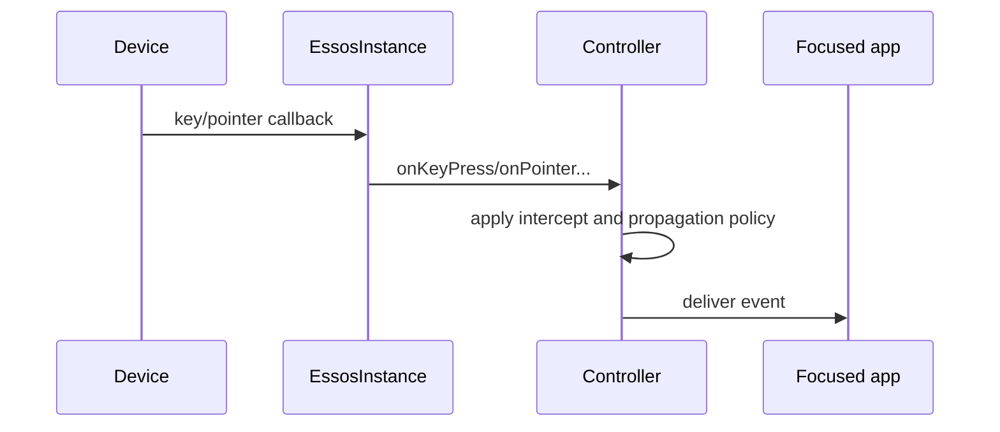
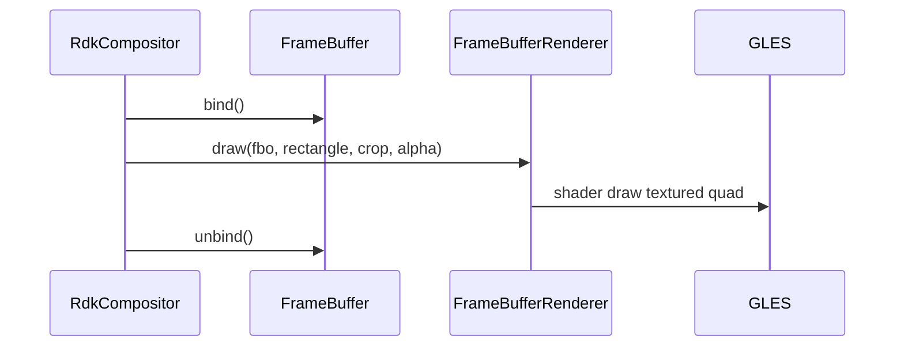
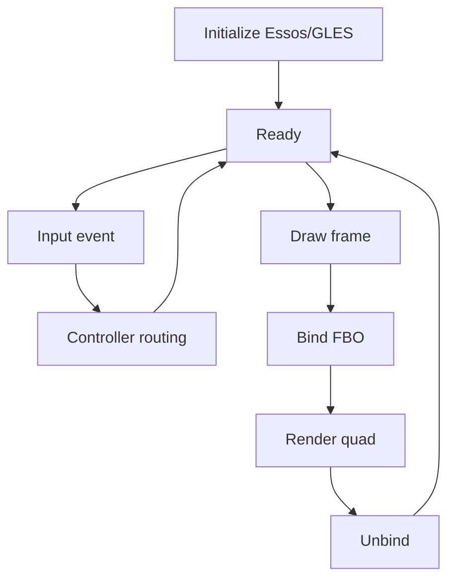

# Input, Display Bridge, and Rendering

## 1. High-Level Purpose & Architecture

### Role in ENT / RDK infrastructure
This subsystem connects Linux/Essos device input to window-manager events and provides the OpenGL ES path used for virtual-display and FBO composition. It is the platform edge between embedded device hardware, Wayland clients, and pixels.

### Responsibilities
- Represent key, touchpad, and slider input using `InputEvent`.
- Configure Linux input devices and map key constants.
- Bridge input through the Essos singleton.
- Allocate/bind framebuffer objects and render textured quads.
- Track and draw the cursor and load image assets.

### Interacting subsystems and what it does not do
It feeds `CompositorController` and `RdkCompositor`; it does not decide application focus policy or implement the Firebolt protocol. Rendering helpers do not own the higher-level display registry.

## 2. Architectural Overview



## 3. Code Organization (Folder & File-Level)

- `include/inputevent.h`: event union and state enums.
- `include/linuxinput.h`, `src/linuxinput.cpp`: device descriptors and configuration parsing.
- `include/linuxkeys.h`, `src/linuxkeys.cpp`: key constants/mappings.
- `include/essosinstance.h`, `src/essosinstance.cpp`: Essos singleton and input/display bridge.
- `include/framebuffer.h`, `src/framebuffer.cpp`: FBO/texture ownership and bind operations.
- `include/framebufferrenderer.h`, `src/framebufferrenderer.cpp`: singleton shader renderer.
- `include/cursor.h`, `src/cursor.cpp`: cursor position, hotspot, size, and inactivity behavior.
- `include/rdkwindowmanagerimage.h`, `src/rdkwindowmanagerimage.cpp`: image decode/load support.

The Linux input configuration path is `/etc/rdkwindowmanager/linuxinput.config`, but its grammar is not documented in the repository.

## 4. Class & Interface Documentation

`InputEvent` is a value struct with `deviceId`, `timestampMs`, a `Type`, and a discriminated `Details` union. Its key states are `Pressed`, `Released`, `VirtualPress`, and `VirtualRelease`.

`EssosInstance` is a singleton around `EssCtx`. It initializes Essos, sets resolution and key-repeat policy, forwards key/pointer events, and exposes AV-blocking and ERM queries.

`FrameBuffer` owns width, height, texture ID, and FBO ID. `bind`/`unbind` control the draw target. `FrameBufferRenderer` owns shader locations and draws a framebuffer into a destination rectangle with crop and alpha.

```cpp
InputEvent(uint32_t id, uint32_t ts, Type t)
: deviceId(id), timestampMs(ts), type(t), details()
{ }
```

Source: [include/inputevent.h](../../include/inputevent.h).

## 5. Configuration & Build Integration

The shared target links Essos, EGL, GLESv2, Wayland EGL, and pthread. `RDK_WINDOW_MANAGER_BUILD_KEY_METADATA` adds `RDK_WINDOW_MANAGER_ENABLE_KEY_METADATA`; key-repeat support is separately feature-gated. OpenGL test-app support is controlled by `RDK_WINDOW_MANAGER_BUILD_TEST_APP_WITH_OPENGL`.

Runtime key timing is supplied through controller/core configuration and passed to `EssosInstance::configureKeyInput`. Device mapping is file-based, while key constants are compiled in `linuxkeys.h`.

## 6. Internal Workflows & Execution Flow

1. The core initializes Essos and configures resolution and key timing.
2. Device input becomes an `InputEvent` or a key/pointer callback.
3. `EssosInstance` forwards the callback to controller/compositor routing.
4. The controller applies focus/intercept/listener policy.
5. A compositor draw may bind an FBO, render content, crop/scale it, and unbind it.
6. Cursor activity resets inactivity state; inactivity can hide or report the cursor.

External API return values and context validity must be checked at the implementation boundary. The key metadata bit layout and Linux input configuration grammar are not specified by the headers.

## 7. Diagrams & Visual Aids







## 8. Testing & Quality Analysis

Input behavior is exercised through controller tests and test applications; rendering is also available through the OpenGL test-app option. Suggested coverage includes malformed device configuration, unsupported event types, key-repeat boundaries, lost Essos contexts, framebuffer allocation failure, and crop/alpha edge cases. No dedicated renderer unit-test suite is visible.

## 9. Beginner-to-Expert Teaching Mode

### Must know first
Start with `InputEvent`, then follow one key from Essos to controller. For rendering, learn the FBO -> texture -> shader-quad path before studying transforms.

### Advanced learning path
Study virtual versus natural resolution, metadata feature gating, cursor inactivity, and the interaction between FBO rendering and hole-punch overlays. Then inspect GLES error handling and resource destruction.

### Missing or ambiguous
The repository does not define the exact `/etc/rdkwindowmanager/linuxinput.config` syntax, 64-bit key metadata layout, or a complete contract for cursor inactivity timing.
