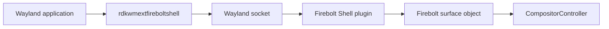
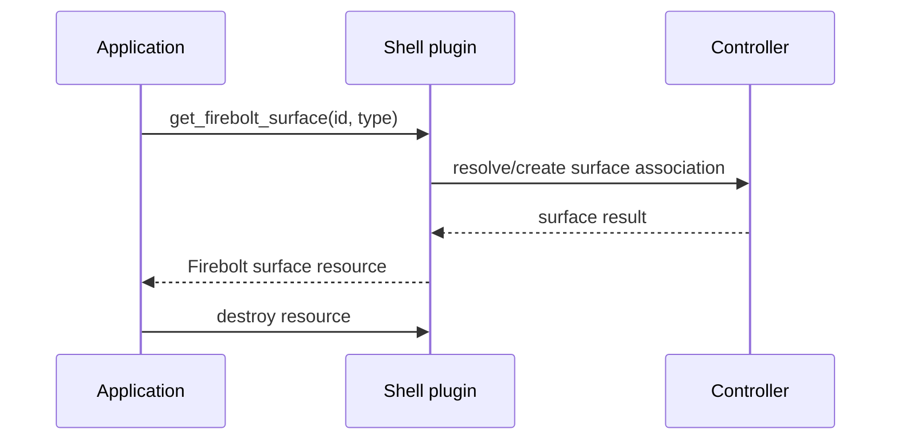
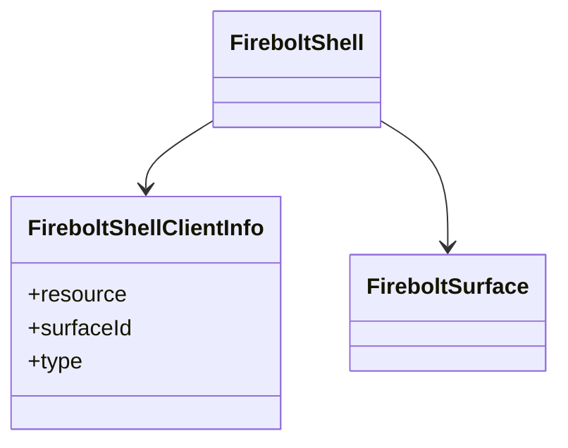
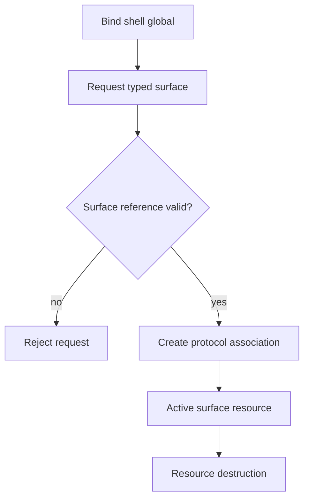

# Firebolt Shell Extension

## 1. High-Level Purpose & Architecture

### Role in ENT / RDK infrastructure
Firebolt Shell bridges ordinary Wayland surfaces to RDK's typed Firebolt surface model. It lets a client request a Firebolt surface handle for an existing `wl_surface`.

### Responsibilities
- Provide the `firebolt_shell_get_firebolt_surface` request.
- Validate and associate a surface ID and Firebolt surface type.
- Emit or manage resource lifecycle for shell clients.

### Interacting subsystems and what it does not do
The shell plugin creates the protocol-side relationship; surface property mutation belongs to Firebolt Surface and the compositor/controller. It does not render pixels or own z-order policy.

## 2. Architectural Overview



## 3. Code Organization (Folder & File-Level)

- `protocol/firebolt_shell.xml`: protocol contract and surface-type enum values.
- `src/firebolt_shell_protocol.c`: generated protocol bindings.
- `src/firebolt_shell.cpp`: server resource implementation.
- `include/`: public client/plugin headers.
- `CMakeLists.txt`: client library and Westeros plugin targets.

## 4. Class & Interface Documentation

`FireboltShell` manages shell resources and maps a surface request to a Firebolt surface. `FireboltShellClientInfo` records the per-resource association. The request takes a surface ID and type; the type constants include standard, video, popup, and notification variants as defined by the protocol.

Representative request name:

```text
firebolt_shell_get_firebolt_surface(surfaceId, type)
```

Source: [extensions/firebolt_shell/src/firebolt_shell.cpp](../extensions/firebolt_shell/src/firebolt_shell.cpp).

Lifecycle is bind -> request surface -> use returned protocol object -> destroy resource. Exact validation of whether the referenced surface exists is implementation-dependent and should be checked in the plugin.

## 5. Configuration & Build Integration

`RDK_WINDOW_MANAGER_BUILD_FIREBOLT_SHELL_EXTENSION` gates the extension. The client target is `rdkwmextfireboltshell_shared`; the server target is `wstplugin_rdkwmfireboltshell_shared`. The former links `wayland-client`; the latter links `wayland-server` and the main shared library.

Both libraries install under `lib/` or `lib/plugins/westeros/` as specified in the extension CMake file.

## 6. Internal Workflows & Execution Flow

1. The application binds the shell global.
2. It submits a surface ID and typed-surface request.
3. The plugin creates/associates the protocol resource and controller surface state.
4. Firebolt Surface or WM operations mutate the associated state.
5. Wayland resource destruction removes the association.

The repository does not fully describe how IDs are allocated across clients or when shell-created objects become visible to compositor drawing.

## 7. Diagrams & Visual Aids







## 8. Testing & Quality Analysis

Focused tests live in `tests/L1_Tests/firebolt_shell_tests/`. Recommended additions cover each surface type, invalid IDs/types, repeated requests, resource destruction, and cross-client isolation.

## 9. Beginner-to-Expert Teaching Mode

### Must know first
Learn that Shell is an adapter: it gives a client a typed handle, while Surface carries most property operations.

### Advanced learning path
Trace generated protocol bindings, Wayland resource cleanup, ID ownership, and the handoff from shell to compositor/controller state.

### Missing or ambiguous
The exact surface-ID namespace, invalid-request protocol errors, and plugin registration timing are not completely specified by the discovered public files.
