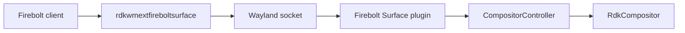
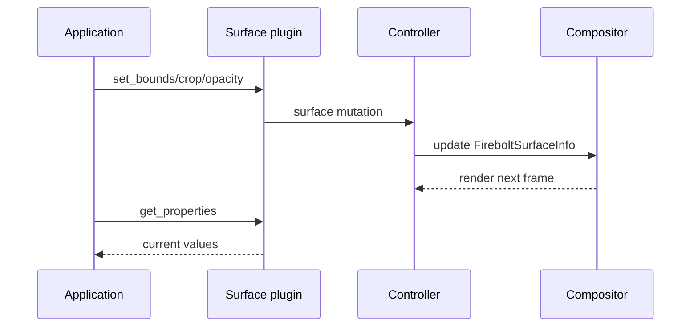
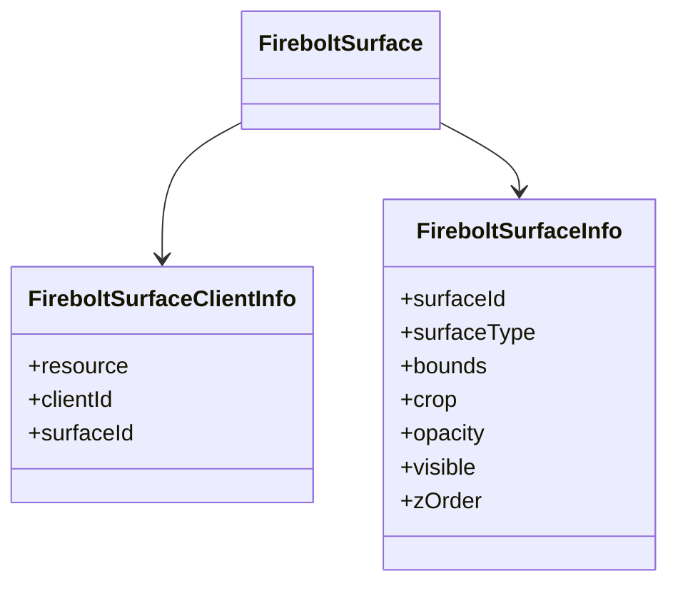
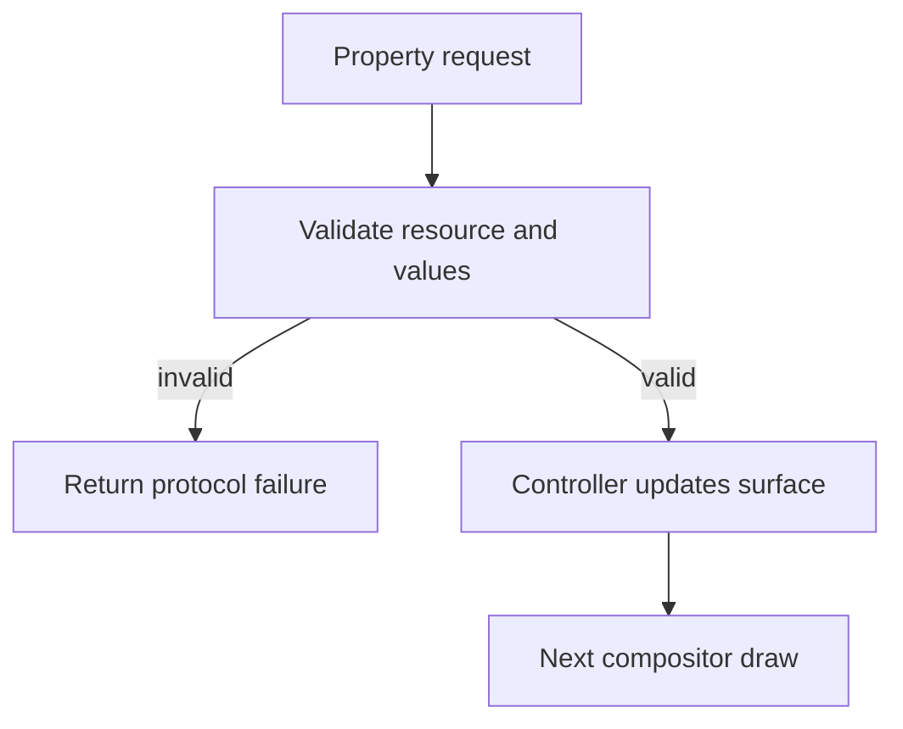

# Firebolt Surface Extension

## 1. High-Level Purpose & Architecture

### Role in ENT / RDK infrastructure
Firebolt Surface is the fine-grained Wayland property interface for application surfaces in the RDK composition stack.

### Responsibilities
- Set and query surface name, visibility, bounds, crop, z-order, and opacity.
- Destroy the protocol surface resource.
- Associate client requests with controller/compositor surface state.

### Interacting subsystems and what it does not do
It delegates state changes to `CompositorController` and `RdkCompositor`. It does not implement frame rendering, input focus policy, or transport beyond Wayland request/event handling.

## 2. Architectural Overview



## 3. Code Organization (Folder & File-Level)

- `protocol/firebolt_surface.xml`: wire protocol.
- `src/firebolt_surface_protocol.c`: generated bindings.
- `src/firebolt_surface.cpp`: server implementation.
- `include/`: public protocol/plugin headers.
- `CMakeLists.txt`: client and Westeros plugin targets.

The handwritten server implementation is the authority for validation and controller calls; generated C should be treated as transport glue.

## 4. Class & Interface Documentation

`FireboltSurface` owns per-resource behavior. The request set includes `destroy`, `set_name`, `set_visible`, `set_bounds`, `set_crop`, `set_zorder`, `set_opacity`, and `get_properties`. `FireboltSurfaceClientInfo` stores resource/client association.

The corresponding controller methods are explicit in [include/compositorcontroller.h](../include/compositorcontroller.h): `setFireboltSurfaceBounds`, `setFireboltSurfaceCrop`, `setFireboltSurfaceVisibility`, `setFireboltSurfaceOpacity`, `setFireboltSurfaceZorder`, and `fireboltSurfaceDestroy`.

Representative protocol operation names:

```text
set_bounds
set_crop
set_zorder
set_opacity
get_properties
```

Source: [extensions/firebolt_surface/src/firebolt_surface.cpp](../extensions/firebolt_surface/src/firebolt_surface.cpp).

## 5. Configuration & Build Integration

`RDK_WINDOW_MANAGER_BUILD_FIREBOLT_SURFACE_EXTENSION` controls this extension under the broader extensions option. Targets are `rdkwmextfireboltsurface_shared` and `wstplugin_rdkwmfireboltsurface_shared`; client and plugin link against Wayland client/server respectively, with the plugin also linking the main shared library.

## 6. Internal Workflows & Execution Flow

1. A shell or WM flow creates/obtains a surface resource.
2. The client sends a property request.
3. The plugin validates the resource and forwards the operation to the controller.
4. The compositor updates `FireboltSurfaceInfo` and the next draw observes the change.
5. `get_properties` reads the current state; `destroy` removes it.

The code distinguishes bounds, crop, natural render size, and logical display size. The product-level meaning of every coordinate space is not fully specified in the protocol documentation discovered here.

## 7. Diagrams & Visual Aids







## 8. Testing & Quality Analysis

Focused coverage is under `tests/L1_Tests/firebolt_surface_tests/`. Recommended tests cover every setter/getter pair, invalid dimensions/crop rectangles, opacity boundaries, visibility transition events, z-order ordering, and destruction followed by stale requests.

## 9. Beginner-to-Expert Teaching Mode

### Must know first
Treat a Firebolt surface as state attached to a Wayland resource. Learn each property setter and its corresponding controller call.

### Advanced learning path
Study coordinate-space conversion, crop/scale interaction, event transition rules, and resource lifetime under client disconnect.

### Missing or ambiguous
The exact coordinate units and validation ranges for bounds, crop, opacity, and z-order should be confirmed from the protocol XML and target behavior; headers alone do not define all constraints.
