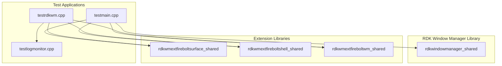
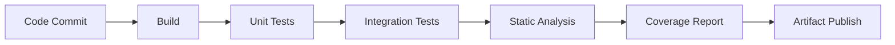

# RDK Window Manager - Testing Guide

## 1. Overview

This document covers the test infrastructure, test applications, and quality analysis for the RDK Window Manager.

---

## 2. Test Applications

### Build Configuration

Test applications are enabled via CMake options:

```cmake
option(RDK_WINDOW_MANAGER_BUILD_TEST_APP "Build test applications" ON)
option(RDK_WINDOW_MANAGER_BUILD_TEST_APP_WITH_OPENGL "Build with OpenGL support" ON)
```

### Test Executables

| Executable | Purpose | Source |
|------------|---------|--------|
| `rdkwindowmanagertest` | Main test application | `tests/testmain.cpp` |
| `rdkwmtest` | Window manager test suite | `tests/testrdkwm.cpp` |

### Building Tests

```bash
cmake .. \
    -DRDK_WINDOW_MANAGER_BUILD_TEST_APP=ON \
    -DRDK_WINDOW_MANAGER_BUILD_TEST_APP_WITH_OPENGL=ON \
    -DRDK_WINDOW_MANAGER_LOGGER=ON

make rdkwindowmanagertest rdkwmtest
```

---

## 3. Test Application Architecture



---

## 4. Test Categories

### 4.1 Unit Tests

Testing individual components in isolation:

| Component | Test Focus |
|-----------|------------|
| `RdkWindowManagerData` | Data type conversions, operators |
| `Logger` | Log levels, file output, formatting |
| `InputEvent` | Event structure creation, types |
| `LinuxKeys` | Key code mapping, virtual keys |

### 4.2 Integration Tests

Testing component interactions:

| Test Area | Description |
|-----------|-------------|
| Compositor Creation | Create display, verify initialization |
| Focus Management | Focus switching, blur events |
| Z-Order Operations | moveToFront, moveToBack, moveBehind |
| Key Routing | Intercepts, listeners, propagation |
| Surface Properties | Bounds, opacity, visibility, crop |

### 4.3 System Tests

End-to-end testing:

| Test Area | Description |
|-----------|-------------|
| Multi-App Composition | Multiple apps with different z-orders |
| Input Event Flow | Hardware input to application |
| Extension Communication | Wayland protocol extensions |
| Memory Management | Resource cleanup, leak detection |

---

## 5. Manual Testing Procedures

### 5.1 Basic Compositor Test

```bash
# Terminal 1: Start RDK Window Manager
./rdkwindowmanager

# Terminal 2: Run test application
WAYLAND_DISPLAY=myapp ./rdkwindowmanagertest
```

### 5.2 Multi-Application Test

```bash
# Start window manager
./rdkwindowmanager

# Start first application
WAYLAND_DISPLAY=app1 ./test_app1 &

# Start second application  
WAYLAND_DISPLAY=app2 ./test_app2 &

# Verify z-order, focus switching
```

### 5.3 Extension Protocol Test

```bash
# Test Firebolt WM extension
./rdkwmtest --test-wm-extension

# Test Firebolt Surface extension
./rdkwmtest --test-surface-extension

# Test Firebolt Shell extension
./rdkwmtest --test-shell-extension
```

---

## 6. Test Scenarios

### 6.1 Compositor Controller Tests

```cpp
// Test: Create Display
void testCreateDisplay() {
    bool result = CompositorController::createDisplay(
        "testclient",       // client name
        "testdisplay",      // display name
        1920, 1080,         // dimensions
        false, 0, 0,        // virtual display
        false, false,       // topmost, focus
        0, 0                // owner, group
    );
    ASSERT_TRUE(result);
    
    std::vector<std::string> clients;
    CompositorController::getClients(clients);
    ASSERT_CONTAINS(clients, "testclient");
}

// Test: Focus Management
void testFocusManagement() {
    // Create two displays
    CompositorController::createDisplay("app1", "display1", ...);
    CompositorController::createDisplay("app2", "display2", ...);
    
    // Set focus to app1
    CompositorController::setFocus("app1");
    
    std::string focused;
    CompositorController::getFocused(focused);
    ASSERT_EQUALS(focused, "app1");
    
    // Switch focus to app2
    CompositorController::setFocus("app2");
    CompositorController::getFocused(focused);
    ASSERT_EQUALS(focused, "app2");
}

// Test: Z-Order Operations
void testZOrderOperations() {
    CompositorController::createDisplay("bottom", "d1", ...);
    CompositorController::createDisplay("middle", "d2", ...);
    CompositorController::createDisplay("top", "d3", ...);
    
    // Move bottom to front
    CompositorController::moveToFront("bottom");
    
    int32_t zorder;
    CompositorController::getZOrder("bottom", zorder);
    // Verify bottom is now at highest z-order
}
```

### 6.2 Key Intercept Tests

```cpp
// Test: Add Key Intercept
void testKeyIntercept() {
    bool intercepted = false;
    
    // Add intercept for Enter key
    CompositorController::addKeyIntercept(
        "testclient",
        28,         // Enter key
        0,          // No modifiers
        false,      // Not focus only
        false       // Don't propagate
    );
    
    // Simulate key press
    CompositorController::onKeyPress(28, 0, 0);
    
    // Verify intercept was triggered
    ASSERT_TRUE(intercepted);
}

// Test: Key Listener with Activate
void testKeyListenerActivate() {
    CompositorController::createDisplay("voice", "voicedisplay", ...);
    CompositorController::createDisplay("main", "maindisplay", ...);
    
    // Set initial focus to main
    CompositorController::setFocus("main");
    
    // Add voice key listener with activate
    std::map<std::string, RdkWindowManagerData> props;
    props["activate"] = true;
    props["propagate"] = true;
    
    CompositorController::addKeyListener("voice", 167, 0, props);
    
    // Simulate voice key press
    CompositorController::onKeyPress(167, 0, 0);
    
    // Verify focus switched to voice
    std::string focused;
    CompositorController::getFocused(focused);
    ASSERT_EQUALS(focused, "voice");
}
```

### 6.3 Surface Property Tests

```cpp
// Test: Set/Get Bounds
void testSurfaceBounds() {
    CompositorController::createDisplay("testapp", "display", ...);
    
    CompositorController::setBounds("testapp", 100, 100, 800, 600);
    
    uint32_t x, y, width, height;
    CompositorController::getBounds("testapp", x, y, width, height);
    
    ASSERT_EQUALS(x, 100);
    ASSERT_EQUALS(y, 100);
    ASSERT_EQUALS(width, 800);
    ASSERT_EQUALS(height, 600);
}

// Test: Visibility Toggle
void testVisibility() {
    CompositorController::createDisplay("testapp", "display", ...);
    
    // Initially visible
    bool visible;
    CompositorController::getVisibility("testapp", visible);
    ASSERT_TRUE(visible);
    
    // Hide
    CompositorController::setVisibility("testapp", false);
    CompositorController::getVisibility("testapp", visible);
    ASSERT_FALSE(visible);
    
    // Show
    CompositorController::setVisibility("testapp", true);
    CompositorController::getVisibility("testapp", visible);
    ASSERT_TRUE(visible);
}
```

---

## 7. Logging for Tests

### Enable Test Logging

```cpp
// In test setup
Logger::setLogLevel("Debug");
#ifdef RDK_WINDOW_MANAGER_LOGGER
Logger::setLogFile("/tmp/rdkwm_test.log");
#endif
Logger::enableFlushing(true);
```

### Log Monitor (testlogmonitor.cpp)

The log monitor provides real-time log analysis during tests:

```cpp
// Monitor for specific log patterns
void monitorLogs(const std::string& pattern) {
    // Implementation watches log file for patterns
    // Reports matches for test verification
}
```

---

## 8. Test Coverage Analysis

### Current Coverage Areas

| Component | Coverage | Notes |
|-----------|----------|-------|
| CompositorController | ~70% | Core operations covered |
| RdkCompositor | ~60% | Rendering paths partially tested |
| EssosInstance | ~40% | Hardware-dependent, limited testing |
| Extensions | ~50% | Protocol tests available |
| Input Handling | ~65% | Key scenarios covered |

### Missing Test Coverage

| Area | Priority | Reason |
|------|----------|--------|
| FBO Rendering | Medium | Requires GPU context |
| VNC Server | Low | Optional feature |
| Memory Monitoring | Medium | Requires controlled environment |
| Multi-threading | High | Race conditions difficult to test |
| Error Recovery | High | Edge cases need coverage |

---

## 9. Suggested Test Additions

### 9.1 Stress Tests

```cpp
// Test: Rapid compositor creation/destruction
void testRapidCompositorLifecycle() {
    for (int i = 0; i < 100; i++) {
        std::string name = "app" + std::to_string(i);
        CompositorController::createDisplay(name, name, ...);
        CompositorController::kill(name);
    }
    // Verify no memory leaks
}

// Test: Rapid focus switching
void testRapidFocusSwitching() {
    // Create 10 apps
    for (int i = 0; i < 10; i++) {
        CompositorController::createDisplay("app" + std::to_string(i), ...);
    }
    
    // Rapidly switch focus
    for (int j = 0; j < 1000; j++) {
        CompositorController::setFocus("app" + std::to_string(j % 10));
    }
}
```

### 9.2 Edge Case Tests

```cpp
// Test: Invalid client names
void testInvalidClientNames() {
    ASSERT_FALSE(CompositorController::setFocus("nonexistent"));
    ASSERT_FALSE(CompositorController::setBounds("nonexistent", 0, 0, 100, 100));
    ASSERT_FALSE(CompositorController::kill("nonexistent"));
}

// Test: Boundary values
void testBoundaryValues() {
    CompositorController::createDisplay("test", "display", ...);
    
    // Zero dimensions
    ASSERT_TRUE(CompositorController::setBounds("test", 0, 0, 0, 0));
    
    // Maximum dimensions
    ASSERT_TRUE(CompositorController::setBounds("test", 0, 0, UINT32_MAX, UINT32_MAX));
    
    // Negative positions (should work for off-screen)
    ASSERT_TRUE(CompositorController::setBounds("test", -100, -100, 100, 100));
}

// Test: Opacity boundaries
void testOpacityBoundaries() {
    CompositorController::createDisplay("test", "display", ...);
    
    // Minimum opacity (0 = transparent)
    CompositorController::setOpacity("test", 0);
    
    // Maximum opacity (100 = opaque)
    CompositorController::setOpacity("test", 100);
    
    // Out of range (should clamp)
    CompositorController::setOpacity("test", 150);
    unsigned int opacity;
    CompositorController::getOpacity("test", opacity);
    ASSERT_EQUALS(opacity, 100);  // Clamped to max
}
```

### 9.3 Concurrency Tests

```cpp
// Test: Concurrent access to compositor list
void testConcurrentAccess() {
    std::vector<std::thread> threads;
    
    // Thread 1: Create compositors
    threads.emplace_back([]() {
        for (int i = 0; i < 50; i++) {
            CompositorController::createDisplay("creator" + std::to_string(i), ...);
        }
    });
    
    // Thread 2: Query compositors
    threads.emplace_back([]() {
        for (int i = 0; i < 100; i++) {
            std::vector<std::string> clients;
            CompositorController::getClients(clients);
        }
    });
    
    // Thread 3: Modify properties
    threads.emplace_back([]() {
        for (int i = 0; i < 100; i++) {
            CompositorController::setVisibility("creator0", i % 2 == 0);
        }
    });
    
    for (auto& t : threads) {
        t.join();
    }
    
    // Verify no crashes or data corruption
}
```

---

## 10. Continuous Integration

### CI Pipeline Stages



### CI Configuration Example

```yaml
# .github/workflows/ci.yml
name: RDK Window Manager CI

on: [push, pull_request]

jobs:
  build-and-test:
    runs-on: ubuntu-latest
    steps:
      - uses: actions/checkout@v2
      
      - name: Install Dependencies
        run: |
          sudo apt-get update
          sudo apt-get install -y cmake build-essential
          # Install Westeros, Essos, etc.
      
      - name: Build
        run: |
          mkdir build && cd build
          cmake .. -DRDK_WINDOW_MANAGER_BUILD_TEST_APP=ON
          make -j$(nproc)
      
      - name: Run Tests
        run: |
          cd build
          ./rdkwindowmanagertest
          ./rdkwmtest
      
      - name: Upload Coverage
        uses: codecov/codecov-action@v1
```

---

## 11. Debugging Tests

### GDB Debugging

```bash
# Debug test application
gdb ./rdkwindowmanagertest

# Set breakpoints
(gdb) break CompositorController::createDisplay
(gdb) break RdkCompositor::onKeyPress

# Run with arguments
(gdb) run --test-case=focus
```

### Valgrind Memory Check

```bash
# Check for memory leaks
valgrind --leak-check=full --show-leak-kinds=all \
    ./rdkwindowmanagertest

# Check for threading issues
valgrind --tool=helgrind ./rdkwindowmanagertest
```

### Address Sanitizer

```bash
# Build with sanitizer
cmake .. -DCMAKE_CXX_FLAGS="-fsanitize=address -g"
make

# Run tests - will report memory errors
./rdkwindowmanagertest
```

---

## 12. Performance Testing

### Frame Rate Measurement

```cpp
void measureFrameRate() {
    double startTime = RdkWindowManager::seconds();
    int frameCount = 0;
    
    while (frameCount < 1000) {
        RdkWindowManager::update();
        RdkWindowManager::draw();
        frameCount++;
    }
    
    double elapsed = RdkWindowManager::seconds() - startTime;
    double fps = frameCount / elapsed;
    
    std::cout << "Average FPS: " << fps << std::endl;
    ASSERT_GREATER_THAN(fps, 30.0);  // Minimum acceptable
}
```

### Memory Usage Monitoring

```cpp
void monitorMemoryUsage() {
    // Get initial memory
    size_t initialMem = getCurrentMemoryUsage();
    
    // Create and destroy many compositors
    for (int i = 0; i < 100; i++) {
        CompositorController::createDisplay("memtest" + std::to_string(i), ...);
    }
    for (int i = 0; i < 100; i++) {
        CompositorController::kill("memtest" + std::to_string(i));
    }
    
    // Get final memory
    size_t finalMem = getCurrentMemoryUsage();
    
    // Should be close to initial (allow small variance)
    ASSERT_LESS_THAN(finalMem - initialMem, 1024 * 1024);  // 1MB tolerance
}
```
