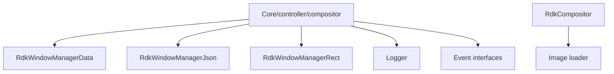
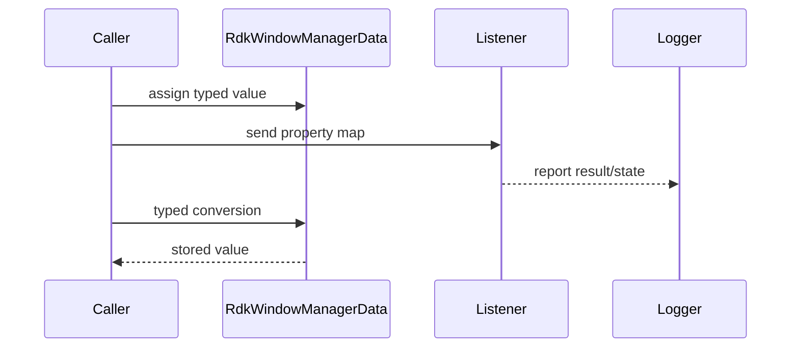
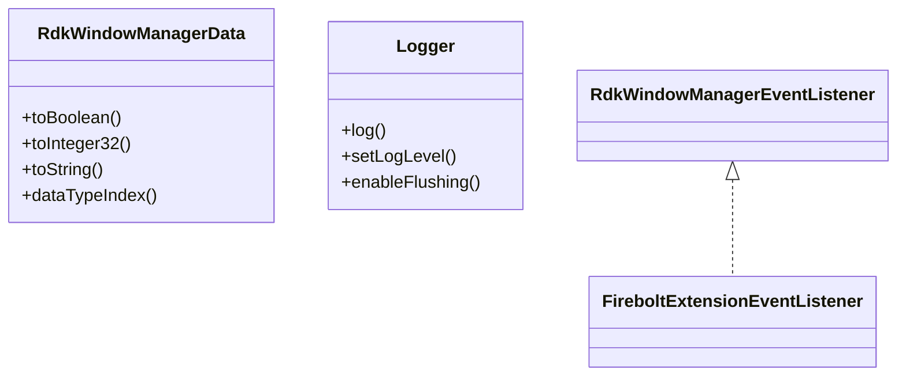
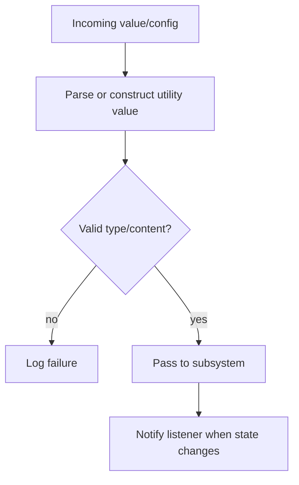

# Utility and Cross-Cutting Support

## 1. High-Level Purpose & Architecture

### Role in ENT / RDK infrastructure
These small components provide shared value types, structured data conversion, JSON loading, logging, image loading, and event contracts used by the larger RDK window-manager subsystems.

### Responsibilities
- Represent rectangles, application states, and generic API values.
- Parse JSON through the RapidJSON wrapper.
- Provide severity-based logging and optional file output.
- Define listener interfaces for lifecycle and extension events.

### Interacting subsystems and what it does not do
Utilities support core, controller, compositor, and extensions. They do not own display lifecycle, make focus decisions, or perform protocol transport.

## 2. Architectural Overview



## 3. Code Organization (Folder & File-Level)

- `include/rdkwindowmanagerdata.h`, `src/rdkwindowmanagerdata.cpp`: typed union wrapper and conversions.
- `include/rdkwindowmanagerjson.h`, `src/rdkwindowmanagerjson.cpp`: JSON file/document helper.
- `include/rdkwindowmanagerrect.h`: rectangle value type.
- `include/application.h`: application state and MIME constants.
- `include/rdkwindowmanagerevents.h`: listener contracts.
- `include/logger.h`, `src/logger.cpp`: logging implementation.
- `include/rdkwindowmanagerimage.h`, `src/rdkwindowmanagerimage.cpp`: image decode/load support.

## 4. Class & Interface Documentation

`RdkWindowManagerData` stores one of several scalar, string, or pointer representations and exposes typed `to...` methods and assignment operators. It is used in listener/property maps, so callers must request the matching type.

`Logger` exposes `log`, `setLogLevel`, `logLevel`, flushing controls, and optional file configuration under `RDK_WINDOW_MANAGER_LOGGER`. Event interfaces define virtual callbacks for application lifecycle, input, focus, visibility, size changes, and extension client events.

```cpp
enum LogLevel {
    Debug,
    Information,
    Warn,
    Error,
    Fatal
};
```

Source: [include/logger.h](../../include/logger.h).

Lifecycle is simple construction/use/destruction for value helpers; logger/file lifetime and string ownership are implemented in their `.cpp` files.

## 5. Configuration & Build Integration

The root CMake file always includes data, JSON, and logger sources. `RDK_WINDOW_MANAGER_LOGGER` adds the logger compile definition, log-file path definition, and `tests/testlogmonitor.cpp` to the `rdkwmtest` target. Image support links `libjpeg` and `libpng`.

The logger level is runtime-configurable through the core/controller API and environment parsing. JSON and image file paths are supplied by callers; no central schema is present in the root build file.

## 6. Internal Workflows & Execution Flow

1. A controller or extension receives a property map.
2. `RdkWindowManagerData` carries values across the public boundary.
3. JSON helpers load structured configuration where used.
4. Runtime failures and state transitions are sent to `Logger`.
5. Listener interfaces receive callbacks from controller/compositor code.

Conversion error behavior, pointer ownership in `RdkWindowManagerData`, and JSON schema validation should be checked in the implementations before accepting arbitrary external data.

## 7. Diagrams & Visual Aids







## 8. Testing & Quality Analysis

Utility behavior is indirectly used by controller and extension tests. Add focused tests for every data conversion, string/pointer ownership, malformed JSON, logger filtering/flushing, image decode failures, and event callback contracts. The discovered tree has no obvious standalone utility test suite.

## 9. Beginner-to-Expert Teaching Mode

### Must know first
Start with `RdkWindowManagerData` as a typed transport value and `Logger` as the standard runtime diagnostic path.

### Advanced learning path
Study ownership and copy semantics, listener reentrancy, JSON validation, and how logging choices affect field diagnosis. Then follow data maps across the Firebolt/controller boundary.

### Missing or ambiguous
The public headers do not define a complete JSON schema, conversion-failure policy, or ownership contract for pointer-valued data.
