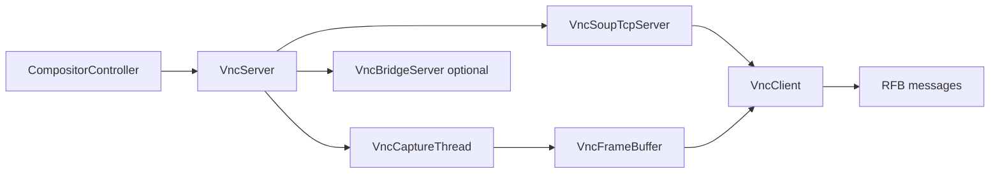
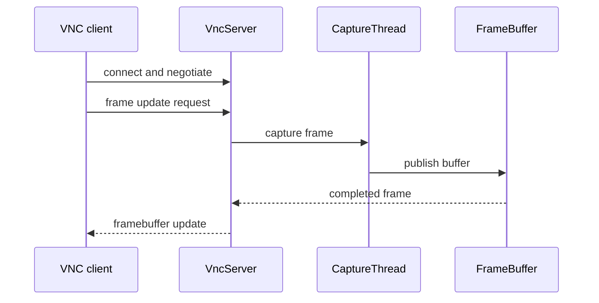
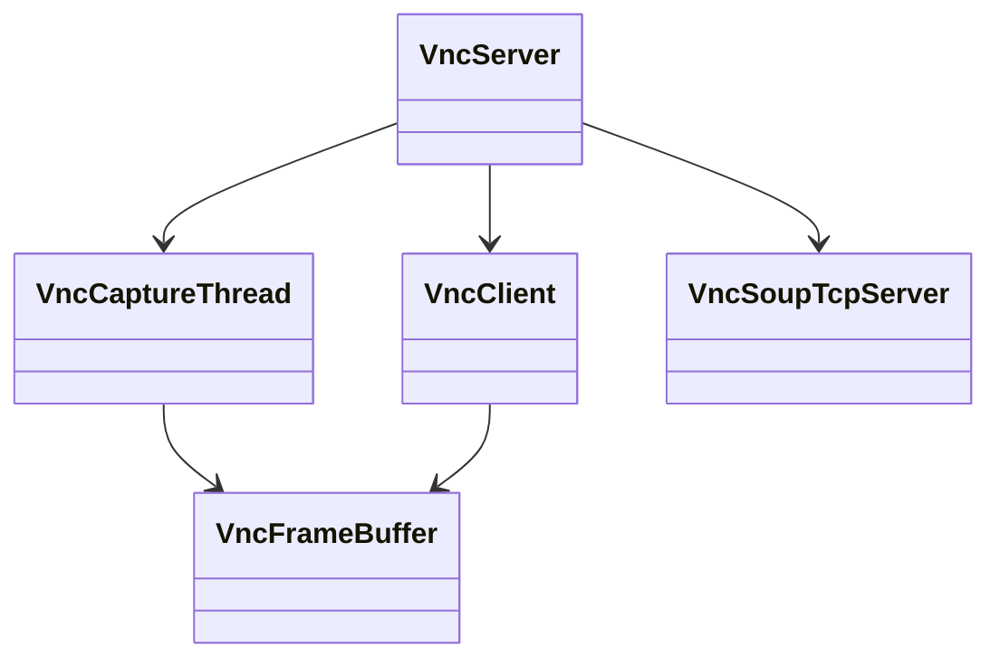
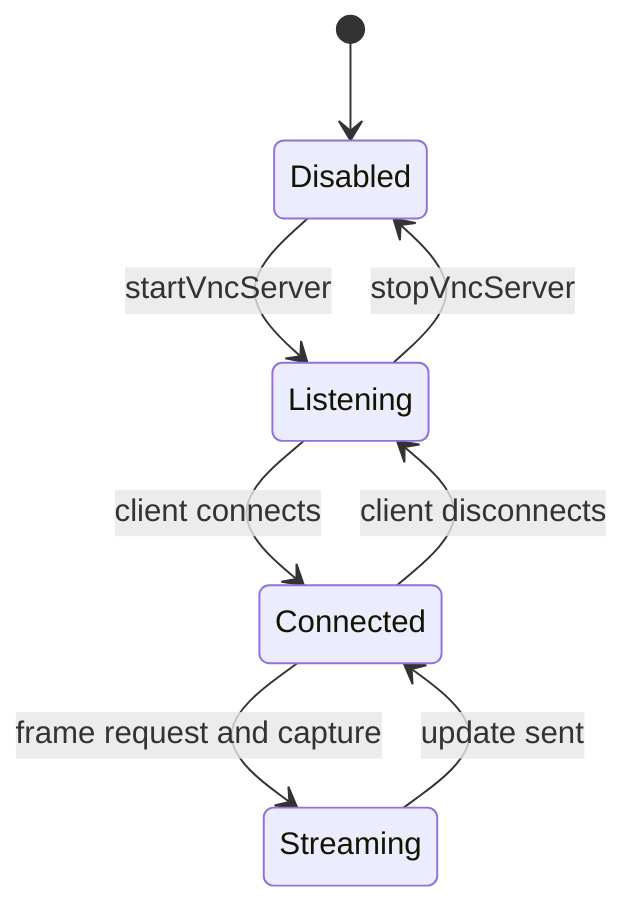

# Optional VNC Server

## 1. High-Level Purpose & Architecture

### Role in ENT / RDK infrastructure
The optional VNC subsystem exposes the composed display to a remote RFB/VNC client for frame-buffer access; current VNC input messages are decoded but ignored. It is a diagnostic/support integration rather than the primary compositor.

### Responsibilities
- Start and stop a TCP VNC service, normally on port 5900.
- Manage clients, RFB negotiation, pixel formats, and frame-update requests.
- Capture compositor frames through DMA or memory buffers, with an asynchronous capture thread.
- Optionally bridge to VNCServer2 using the bridge protocol.

### Interacting subsystems and what it does not do
It consumes rendered frames. Current VNC key and pointer messages are decoded or consumed but are not routed to the window manager. It does not replace Westeros composition or define application/window policy.

## 2. Architectural Overview



## 3. Code Organization (Folder & File-Level)

- `include/VncServer/VncServer.h`, `src/VncServer/VncServer.cpp`: service singleton/lifecycle and main loop integration.
- `VncServerFactory.*`: factory boundary for optional implementation.
- `VncClient.*`: per-client protocol state and pixel conversion.
- `VncFrameBuffer.*`, `VncBuffer.*`, `MemFd.h`: shared or RAM-backed frame storage.
- `VncCaptureThread.*`: asynchronous GPU-to-CPU/PBO capture.
- `VncSoupTcpServer.*`, `VncSoupTcpSocket.*`: LibSoup transport.
- `VncTypes.h`: RFB message and pixel-format types.
- `VncBridgeProtocol.h`, `VncBridgeServer.*`: optional VNCServer2 bridge.
- `IVncSocket.h`, `IVncSoupSubServer.h`: testable transport abstractions.

## 4. Class & Interface Documentation

`VncServer` owns service lifecycle and client/server coordination. `VncClient` tracks connection states and negotiated pixel formats. `VncFrameBuffer` represents the producer/consumer frame storage; `VncCaptureThread` performs capture away from the main control path.

The bridge types define message headers and payloads for buffer management, screenshots, and key routing. Exact protocol ownership is split between the VNC client and bridge classes.

Representative public lifecycle is exposed through the controller:

```cpp
static bool startVncServer();
static bool stopVncServer();
```

Source: [include/compositorcontroller.h](../../include/compositorcontroller.h).

The code does not make a complete timing contract between capture completion and RFB update requests; that is a key integration detail to verify on target hardware.

## 5. Configuration & Build Integration

VNC is enabled by `RDK_WINDOW_MANAGER_VNC_SERVER`. It adds `-DRDK_WINDOW_MANAGER_VNC_SERVER`, defines `RDK_WINDOW_MANAGER_VNC_SERVER_PORT=5900`, appends VNC sources, and requires GLib/GIO/GObject, LibSoup, Boost, and `secure_wrapper`. `ENABLE_RDKWINDOWMANAGER_VNCSERVER2` additionally appends `VncBridgeServer.cpp` and defines the bridge macro.

The CMake file links the VNC libraries only when the feature is enabled. No runtime port override is documented in the discovered source/configuration files.

## 6. Internal Workflows & Execution Flow

1. Controller requests server start.
2. `VncServer` creates transport/main-loop resources and listens on the configured port.
3. A connection becomes a `VncClient`, negotiates protocol and pixel format, and requests updates.
4. Capture obtains a frame into `VncFrameBuffer`; the client serializes it as an RFB update.
5. Remote key events are decoded and ignored by the current implementation; they are not routed to controller input.
6. Stop closes clients, capture, transport, and loop resources.

Failures should be logged and must not leave owned sockets or capture threads active. The exact synchronization between buffer reuse and network writes is not fully documented by interfaces alone.

## 7. Diagrams & Visual Aids







## 8. Testing & Quality Analysis

Transport interfaces and VNC classes are available for unit-style mocking, while general test executables are built from the root CMake file. Recommended tests cover handshake rejection, every declared pixel format, partial writes, disconnect during capture, double-buffer reuse, port failures, and bridge message validation. No VNC-specific test directory is visible under `tests/L1_Tests`.

## 9. Beginner-to-Expert Teaching Mode

### Must know first
Learn the RFB idea of negotiated pixel format and update request, then follow one frame through capture, buffer, and socket.

### Advanced learning path
Study PBO/asynchronous capture, buffer ownership, LibSoup callbacks, and the optional VNCServer2 bridge. Validate thread shutdown and lifetime ordering before changing capture code.

### Missing or ambiguous
The built-in RFB server advertises only `SecurityType::None` (no authentication); deployment must provide network access control. Capture-to-update synchronization and runtime port configuration beyond 5900 remain ambiguous.
