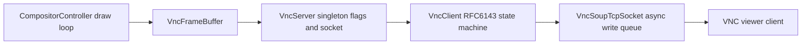
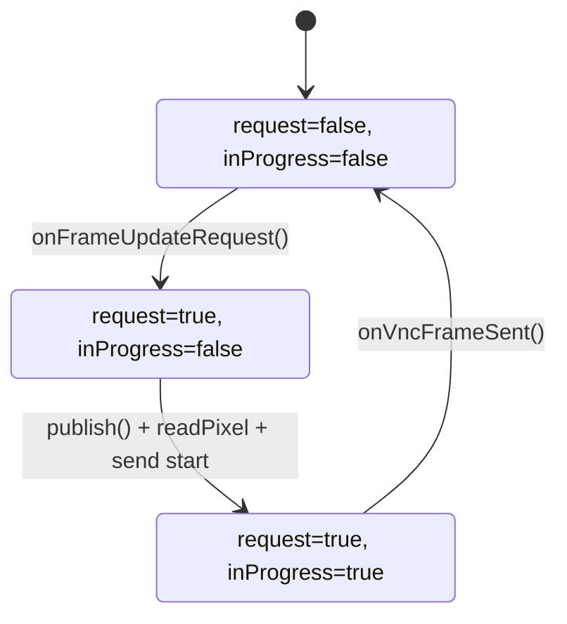
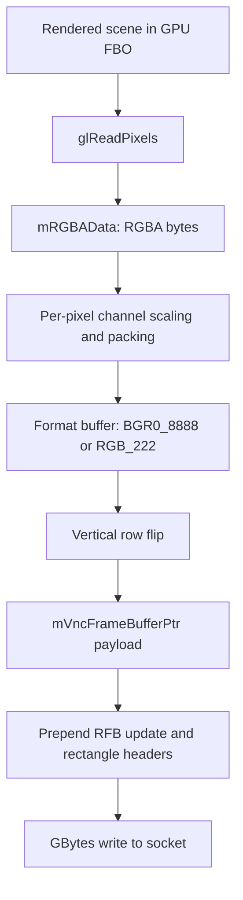

# RDK Window Manager VNC Server Deep Dive

## Purpose and Scope

This document explains how the VNC server path works in this repository, with emphasis on:

- When framebuffer data is captured ("saved")
- What is saved in each buffer
- What is sent when a frame is published
- How request and in-progress flags gate transmission

The flow covered here is based on:

- `src/compositorcontroller.cpp`
- `src/VncServer/VncServer.cpp`
- `src/VncServer/VncSoupTcpServer.cpp`
- `src/VncServer/VncSoupTcpSocket.cpp`
- `src/VncServer/VncClient.cpp`
- `src/VncServer/VncFrameBuffer.cpp`
- `include/VncServer/VncTypes.h`

## High-Level Architecture

At runtime, the VNC path has four cooperating layers:

1. Render loop layer (`CompositorController`)
2. Capture and packaging layer (`VncFrameBuffer`)
3. Protocol/state machine layer (`VncClient`)
4. Transport layer (`VncSoupTcpServer` + `VncSoupTcpSocket`)



## Startup and Ownership

## 1) Server startup

- `CompositorController::startVncServer()` gets screen resolution.
- It calls `VncServer::start(width, height)`.
- `VncServer`:
  - Applies iptables rules for TCP port 5900.
  - Starts `VncSoupTcpServer` (GLib socket service).
  - Spawns GLib main loop thread.

## 2) Framebuffer object creation

- On successful server start, `gVncBuffer = make_shared<VncFrameBuffer>(width, height)`.
- `VncFrameBuffer` constructor:
  - Creates offscreen `FrameBuffer` object used by capture path.
  - Allocates `mRGBAData` (`width * height * 4`, CPU-side raw RGBA bytes).
  - Calls `initVncFrameBuffer()` to allocate reusable shared memory block `mVncFrameBufferPtr`.

## 3) Client connection and protocol state

- TCP accept creates `VncClient` around the socket.
- `VncClient` performs RFB handshake (`ProtocolVersion -> Security -> ClientInit -> Running`).
- Once running, client messages (SetPixelFormat/SetEncodings/FramebufferUpdateRequest) control frame transmission behavior.

## Render-Loop Integration (When Publish Is Attempted)

Within `CompositorController::draw()`:

1. If VNC is enabled, `gVncBuffer->begin()` binds/clears the VNC capture FBO.
2. Normal compositor draw path renders scenes.
3. If VNC is enabled, `gVncBuffer->publish()` is called every draw cycle.
4. `gVncBuffer->end()` unbinds capture FBO.

Important: `publish()` is called every frame, but actual transmission is conditional.

## Buffer Inventory: What Is Saved, When, and Why

| Buffer | Type | Allocation Time | What It Stores | Updated When | Used For |
|---|---|---|---|---|---|
| `FrameBuffer` object (`mFrameBuffer`) | GPU/offscreen render target | `VncFrameBuffer` construction | Rendered scene in GPU memory | During compositor draw loop after `begin()` | Source for `glReadPixels` |
| `mRGBAData` | `std::vector<uint8_t>` in CPU memory | `VncFrameBuffer` construction | Raw RGBA pixels (`GL_RGBA`, `GL_UNSIGNED_BYTE`) | In `readPixel()` during `publish()` | Input to pixel format conversion |
| `mVncFrameBufferPtr` | `memfd` + `mmap` shared memory | `initVncFrameBuffer()` during construction | Serialized VNC message: update header + rectangle header + converted pixel payload | In `sendFrameBufferToVNCClient()` | Outbound network payload backing memory |
| `VncSoupTcpSocket` send queue | Queue of `GBytes*` | Socket creation | Pending outbound protocol payloads | On async write while previous send in progress | Ordered non-blocking send |

## Exact Save/Publish Flow

## Trigger condition

`VncFrameBuffer::publish()` only proceeds when:

- `VncServer::mReadyToSendFrameBufer` is `true` (set by `VncClient::onFrameUpdateRequest()`)
- `VncServer::mFrameBufferUpdateInProgress` is `false`

If no update request flag is set, publish returns immediately.

## Step A: Save pixels from GPU to CPU (`mRGBAData`)

`publish()` calls `readPixel()`:

- Validates framebuffer completeness.
- Calls:

  `glReadPixels(0, 0, width, height, GL_RGBA, GL_UNSIGNED_BYTE, mRGBAData.data())`

This is the key moment where frame content is "saved" from GPU render target into CPU memory.

## Step B: Package and convert into wire buffer (`mVncFrameBufferPtr`)

`publish()` spawns a detached worker thread:

- Worker calls `sendFrameBufferToVNCClient()`.
- It sets `mFrameBufferUpdateInProgress = true` under mutex.
- Writes RFB FramebufferUpdate headers:
  - `VncFrameBufferUpdate` (message type, rectangle count)
  - One `VncFrameBufferRectangle` covering full screen, encoding `Raw`

Then `readAndConvertPixelData(frameOffset)` converts `mRGBAData` into client format and writes pixel bytes at `mVncFrameBufferPtr + frameOffset`.

### Pixel format handling in current implementation

Conversion currently supports only:

- `BGR0_8_8_8_8` (32bpp)
- `RGB_2_2_2` (8bpp)

Any other selected format leads to `bitsPerPixel == 0` and no frame payload sent.

### Vertical flip

After conversion, rows are swapped top/bottom. This corrects OpenGL bottom-left origin to top-left expected by VNC viewers.

## Step C: Publish to socket asynchronously

After payload is prepared:

- Creates `GBytes` referencing the reusable mapped buffer region.
- Calls `IVncSocket::write(data)`.
- `VncSoupTcpSocket` sends asynchronously (`g_output_stream_write_all_async`) and serializes queued sends.

## Step D: Completion callback and flag reset

When write completes and `GBytes` is unreferenced, `VncFrameBuffer::onVncFrameSent()` runs via `free_func` and does:

- `mFrameBufferUpdateInProgress = false`
- `mReadyToSendFrameBufer = false`

So one client request results in one transmitted frame unless the client issues another request.

## What Is Sent on the Wire (Published Payload)

The sent bytes are:

1. `VncFrameBufferUpdate` header (4 bytes)
2. One `VncFrameBufferRectangle` (12 bytes)
3. Pixel payload (`width * height * bytesPerPixel`)

Where:

- `messageType = 0x00` (FramebufferUpdate)
- `numberOfRectangles = 1`
- rectangle covers full frame (`x=0, y=0, width=screenW, height=screenH`)
- `encodingType = Raw`

Notes on buffer layout implementation:

- Header size = `sizeof(VncFrameBufferUpdate) + sizeof(VncFrameBufferRectangle)` = 16 bytes.
- Pixel payload start is aligned to 64-byte boundary (`frameOffset`).
- Header is written at `headerOffset = frameOffset - headerSize`.
- `GBytes` starts at `headerOffset` with length `headerSize + frameWritten`.

This keeps sent data contiguous while aligning pixel payload memory.

## Sequence Diagram: Request to Publish

```mermaid
sequenceDiagram
    participant Viewer as VNC Viewer
    participant Client as VncClient
    participant Server as VncServer flags
    participant Loop as Compositor draw()
    participant FB as VncFrameBuffer
    participant Sock as VncSoupTcpSocket

    Viewer->>Client: FramebufferUpdateRequest
    Client->>Server: setVncFrameUpdateRequestFlag(true)

    loop every draw cycle
        Loop->>FB: publish()
        FB->>Server: getVncFrameUpdateRequestFlag()
        alt request flag false
            FB-->>Loop: return
        else request flag true
            FB->>Server: getVncFrameBufferProgressState()
            alt already sending
                FB-->>Loop: skip
            else idle
                FB->>FB: readPixel() -> mRGBAData
                FB->>FB: worker thread sendFrameBufferToVNCClient()
                FB->>Server: setVncFrameBufferProgressState(true)
                FB->>FB: readAndConvertPixelData() -> mVncFrameBufferPtr
                FB->>Sock: write(GBytes over mapped buffer)
                Sock-->>FB: async write complete + unref
                FB->>Server: setVncFrameBufferProgressState(false)
                FB->>Server: setVncFrameUpdateRequestFlag(false)
            end
        end
    end
```

## State/Flag Behavior



## Data Transformation Diagram



## Concurrency and Synchronization Notes

- `publish()` uses a detached thread for conversion/send path.
- A global mutex (`mVNCFrameBufferContextLock`) protects critical sections of pixel read and frame packaging.
- VNC server flag setters/getters use `mVNCServerContextLock` and atomics.
- Socket write path is async and ordered through `mSendInProgress` + `mSendQueue`.

## Continuous Updates vs One-Shot Updates

- `VncClient` has continuous update message handling, but current `mSupportContinuousUpdates` is initialized to `false`.
- Effective behavior is one-shot request/response per framebuffer update request.
- After each send completion, request flag is reset to false; client must request again.

## Practical Debug Checklist

If frames are not arriving:

1. Confirm `FramebufferUpdateRequest` is received in `VncClient` logs.
2. Confirm `mReadyToSendFrameBufer` transitions true in `VncServer`.
3. Confirm `readPixel()` succeeds (no GL error).
4. Confirm chosen pixel format is one of currently converted formats.
5. Confirm async socket write completion (`sent X bytes`) appears.
6. Confirm `onVncFrameSent()` resets in-progress/request flags.

## Key Takeaways

- Frame capture is demand-driven by client update requests, not push-every-frame.
- "Save" happens in two stages: GPU->CPU (`mRGBAData`), then CPU conversion into wire buffer (`mVncFrameBufferPtr`).
- Publish is asynchronous and serialized at socket layer.
- Current conversion support is narrower than the pixel formats accepted by protocol negotiation, which can lead to dropped update attempts for unsupported conversion targets.